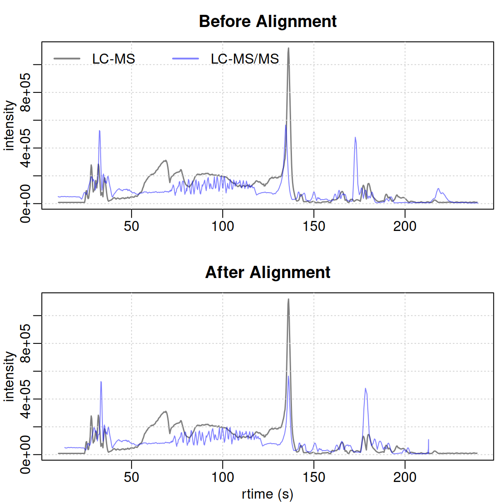
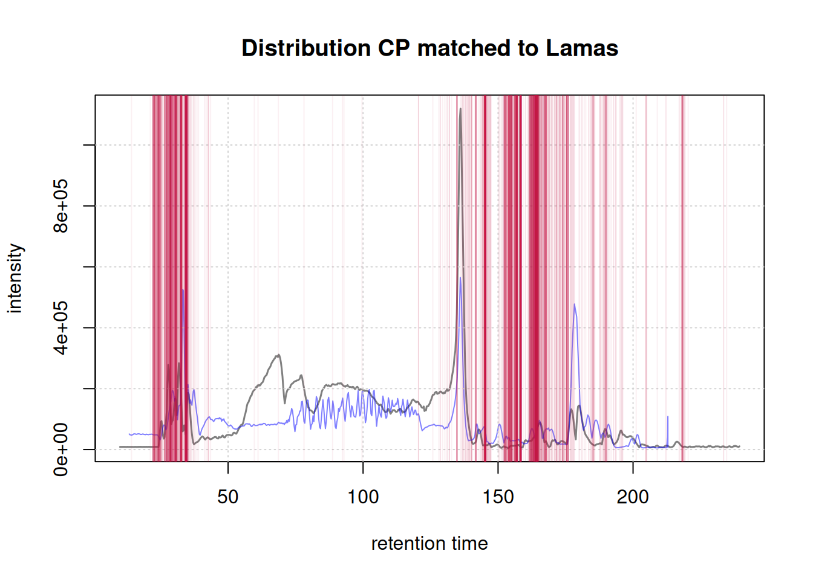

# Seamless Alignment: Merging New Data with and Existing Preprocessed Dataset

## Introduction

In certain experiments, aligning datasets recorded at different times is
necessary. This can involve comparing runs of the same samples from
different laboratories or matching MS2 data to an initial MS1 run.
Variation in retention time across laboratories and LC systems often
requires an alignment step using
[`adjustRtime()`](https://rdrr.io/pkg/xcms/man/adjustRtime.html) with
the `LamaParama` parameter.

As described in the [data
description](https://rformassspectrometry.github.io/metabonaut/articles/dataset-investigation.html)
vignette, some of our samples were run twice: once in LC-MS mode and
again in LC-MS/MS mode. This tutorial will show how to align the
LC-MS/MS run to the preprocessed LC-MS dataset using the *xcms* package
\[@louail_xcms_2025\].

The following packages are needed:

``` r

library(MsIO)
library(alabaster.se)
library(MsBackendMetaboLights)
library(xcms)
library(MsExperiment)
library(Spectra)
library(vioplot)
```

Setting parallel processing to improve the efficiency of the process:

``` r

#' Set up parallel processing using 2 cores
if (.Platform$OS.type == "unix") {
    register(MulticoreParam(2))
} else {
    register(SnowParam(2))
}
```

### Load preprocessed LC-MS object

First, let’s load our pre-processed LC-MS object. This *xcms* result
object was created during the [End-to-end
worflow](https://rformassspectrometry.github.io/metabonaut/articles/end-to-end-untargeted-metabolomics.html)
vignette and is also available in the *Metabonaut* R package. The result
object (an `XcmsExperiment` object) was stored using Bioconductor’s
*alabaster* framework and we below load the object using the
[`readMsObject()`](https://rdrr.io/pkg/MsIO/man/saveMsObject.html)
function providing the path to the stored data. The import function also
takes care of eventually retrieving missing MS data files from the
MetaboLights repository.

``` r

lcms1 <- readMsObject(
    XcmsExperiment(),
    AlabasterParam(system.file("extdata", "preprocessed_lcms1",
                               package = "Metabonaut")))
```

### Load unprocessed LC-MS/MS data

Next, we will load the unprocessed LC-MS/MS data from the MetaboLights
database:

``` r

#' Load form the MetaboLights Database
mlp <- MetaboLightsParam(mtblsId = "MTBLS8735",
                         assayName = paste0("a_MTBLS8735_LC-MSMS_positive_",
                                            "hilic_metabolite_profiling.txt"),
                         filePattern = ".mzML")

lcms2 <- readMsObject(MsExperiment(),
                      mlp,
                      keepOntology = FALSE,
                      keepProtocol = FALSE,
                      simplify = TRUE)
```

We will adjust the
[`sampleData()`](https://rdrr.io/pkg/MsExperiment/man/MsExperiment.html)
of the LC-MS/MS object to make it easier to access:

Show the code

``` r

#adjust sampleData
colnames(sampleData(lcms2)) <- c("sample_name", "derived_spectra_data_file",
                                "metabolite_asssignment_file",
                                "source_name",
                                "organism",
                                "blood_sample_type",
                                "sample_type", "age", "unit", "phenotype")

#let's look at the updated sample data
sampleData(lcms2)[, c("derived_spectra_data_file",
                     "phenotype", "sample_name", "age")] |>
    kable(format = "pipe")
```

| derived_spectra_data_file             | phenotype | sample_name | age |
|:--------------------------------------|:----------|:------------|----:|
| FILES/MS_2_A_POS.mzML                 | CVD       | A           |  53 |
| FILES/MSMS_2_A_CE20_POS.mzML          | CVD       | A           |  53 |
| FILES/MSMS_2_A_CE30_POS.mzML          | CVD       | A           |  53 |
| FILES/MSMS_2_A_CES_POS.mzML           | CVD       | A           |  53 |
| FILES/MS_2_E_POS.mzML                 | CTR       | E           |  66 |
| FILES/MSMS_2_E_CE20_POS.mzML          | CTR       | E           |  66 |
| FILES/MSMS_2_E_CE30_POS.mzML          | CTR       | E           |  66 |
| FILES/MSMS_2_E_CES_POS.mzML           | CTR       | E           |  66 |
| FILES/MS_2_STUDY_POOL_POS.mzML        |           | SP          |  NA |
| FILES/MSMS_2_STUDY_POOL_CE20_POS.mzML |           | SP          |  NA |
| FILES/MSMS_2_STUDY_POOL_CE30_POS.mzML |           | SP          |  NA |
| FILES/MSMS_2_STUDY_POOL_CES_POS.mzML  |           | SP          |  NA |

Table 1. Samples from the LC-MS/MS data set. {.table .caption-top}

We will only keep the MS runs (not MS/MS) and remove pooled samples,
focusing on samples *A* and *E* that are common to both runs.

``` r

# Only keep MS run
lcms2 <- lcms2[!grepl("MSMS", sampleData(lcms2)$derived_spectra_data_file), ]
```

Before alignment, ensure the retention time (RT) ranges match between
the datasets:

``` r

range(rtime(lcms1))
```

    [1]   9.674428 240.115311

``` r

range(rtime(lcms2))
```

    [1]   0.275 480.176

We need to adjust the RT range for the LC-MS/MS object to match the
LC-MS data:

``` r

#' Filter the data to the same RT range as the LC-MS run
lcms2 <- filterRt(lcms2, range(rtime(lcms1)))
```

### Comparing chromatograms

To evaluate retention time shifts, we’ll plot the base peak chromatogram
(BPC):

``` r

idx_A <- which(sampleData(lcms1)$sample_name == "A")
idx_E <- which(sampleData(lcms1)$sample_name == "E")
bpc1 <-chromatogram(lcms1[c(idx_A,idx_E)], aggregationFun = "max",
                    msLevel = 1)
bpc2 <- chromatogram(lcms2, aggregationFun = "max", msLevel = 1)
```

Compare run1 sample A with run2 sample A

Show the code

``` r

plot(bpc1[1, 1], col = "#00000080",
     main = "BPC sample A LC-MS vs A LC-MS/MS", lwd = 1.5, peakType = "none")
grid()
points(rtime(bpc2[1, 1]), intensity(bpc2[1, 1]), col = "#0000ff80", type = "l")
legend("topleft", col = c("#00000080", "#0000ff80"),
       legend = c("LC-MS", "LC-MS/MS"), lty = 1, lwd = 2, horiz = TRUE, bty = "n")
```


Similarly, compare the BPC for sample E:

Show the code

``` r

plot(bpc1[1, 2], col = "#00000080",
     main = "BPC sample E LC-MS vs E LC-MS/MS", lwd = 1.5, peakType = "none")
grid()
points(rtime(bpc2[1, 2]), intensity(bpc2[1, 2]), col = "#0000ff80", type = "l")
legend("topleft", col = c("#00000080", "#0000ff80"),
       legend = c("LC-MS", "LC-MS/MS"), lty = 1, lwd = 2, horiz = TRUE, bty = "n")
```


### Peak detection

Perform peak detection and refining before alignment, as detailed in the
end-to-end vignette. The same setting were applied.

``` r

cwp <- CentWaveParam(peakwidth = c(1, 8), ppm = 15, integrate = 2)
lcms2 <- findChromPeaks(lcms2, param = cwp, chunkSize = 2)
mnpp <- MergeNeighboringPeaksParam(expandRt = 2.5, expandMz = 0.0015,
                                    minProp = 0.75)
lcms2 <- refineChromPeaks(lcms2, param = mnpp, chunkSize = 2)
```

### Alignment

Now, we will attempt to align these two samples with the previous
dataset. The first step is to extract landmark features (referred to as
*lamas*). To achieve this, we will identify the features present in
every phenotype group of the `lcms1` dataset. To do so, we will
categorize (using [`factor()`](https://rdrr.io/r/base/factor.html)) our
data by `phenotype` and only retain the QC samples. This variable will
be utilized to filter the features using the `PercentMissingFilter`
parameter within the
[`filterFeatures()`](https://rdrr.io/pkg/ProtGenerics/man/filterFeatures.html)
function. Here, by setting `threshold = 0` we select the features
present in all QC samples.

``` r

f <- sampleData(lcms1)$phenotype
f[f != "QC"] <- NA
lcms1 <- filterFeatures(lcms1, PercentMissingFilter(threshold = 0, f = f),
                        filled = FALSE)
```

    3694 features were removed

``` r

lcms1_mz_rt <- featureDefinitions(lcms1)[, c("mzmed","rtmed")]
head(lcms1_mz_rt)
```

              mzmed    rtmed
    FT0001 50.98979 203.6001
    FT0002 51.05904 191.1675
    FT0003 51.98657 203.1467
    FT0004 53.02036 203.2343
    FT0005 53.52080 203.1936
    FT0007 54.01010 235.9032

``` r

nrow(lcms1_mz_rt)
```

    [1] 5374

This is what the *lamas* input should look like for alignment. In terms
of how this method works, the alignment algorithm matches
chromatographic peaks from the experimental data to the lamas, fitting a
model based on this match to adjust their retention times and minimize
differences between the two datasets.

Now we can define our parameter object `LamaParama` to prepare for the
alignment. Parameters such as `tolerance`, `toleranceRt`, and `ppm`
relate to the matching between chromatographic peaks and lamas. Other
parameters are related to the type of fitting generated between these
data points. More details on each parameter and the overall method can
be found by searching
[`?adjustRtime`](https://rdrr.io/pkg/xcms/man/adjustRtime.html). Below
is an example using default parameters.

``` r

lp <- LamaParama(lamas = lcms1_mz_rt, method = "loess", span = 0.5,
                 outlierTolerance = 3, zeroWeight = 10, ppm =20,
                 tolerance = 0, toleranceRt = 20, bs = "tp")
```

The `matchLamaChromPeaks()` function facilitates the assessment of how
well the *lamas* correspond with the chromatographic peaks in each file.
We then extract the matched results using the
[`matchedRtimes()`](https://rdrr.io/pkg/xcms/man/LamaParama.html)
function. This will be used later to evaluate the alignment.

``` r

lp <- matchLamasChromPeaks(lcms2, param = lp)
ref_vs_obs <- matchedRtimes(lp)
```

Now we can adjust the retention time of the LC-MS/MS dataset using the
[`adjustRtime()`](https://rdrr.io/pkg/xcms/man/adjustRtime.html)
function.

``` r

#' input into `adjustRtime()`
lcms2 <- adjustRtime(lcms2, param = lp)
```

### Evaluation

We can initially visualizes the difference between adjusted and raw
retention tim in each samples.

``` r

plotAdjustedRtime(lcms2, peakGroupsPch = 1)
grid()
```


We can see that the shift was fairly large between 100 and 150s and
extremely important between 170-205 seconds. Further analysis of peaks
in this area would help us determine if we are over-correcting the
retention time. For now, we will go on like this.

We extract the base peak chromatogram (BPC) of our aligned object:

``` r

lcms2 <- applyAdjustedRtime(lcms2)
bpc2_adj <- chromatogram(lcms2, aggregationFun = "max",
                         msLevel = 1)
```

#### Visualizing Alignment Quality

To evaluate the performance of our alignment process, we generate plots
comparing the alignment of the reference dataset (in black) with our
LC-MS data before (in red) and after (in blue) the adjustment.

Show the code

``` r

#' BPC of sample A
par(mfrow = c(2, 1),  mar = c(2.5, 2.5, 2.5, 0.5), mgp = c(1.5, 0.5, 0))
plot(bpc1[1, 1], col = "#00000080", main = "Before Alignment", lwd = 1.5,
     peakType = "none", xlab = NA)
grid()
points(rtime(bpc2[1,1]), intensity(bpc2[1,1]),
       type = "l",
       col = "#0000ff80")
legend("topleft", col = c("#00000080", "#0000ff80"),
       legend = c("LC-MS", "LC-MS/MS"), lty = 1, lwd = 2, horiz = TRUE, bty = "n")

plot(bpc1[1, 1], col = "#00000080", main = "After Alignment", lwd = 1.5,
     peakType = "none", xlab = "rtime (s)")
grid()
points(rtime(bpc2_adj[1,1]), intensity(bpc2_adj[1,1]),
       type = "l",
       col = "#0000ff80")
```



Show the code

``` r

#' BPC of sample B
par(mfrow = c(2, 1),  mar = c(2.5, 2.5, 2.5, 0.5), mgp = c(1.5, 0.5, 0))
plot(bpc1[1, 2], col = "#00000080", main = "Before Alignment", lwd = 1.5,
     peakType = "none", xlab = NA)
grid()
points(rtime(bpc2[1, 2]), intensity(bpc2[1, 2]), type = "l",
       col = "#0000ff80")
legend("topleft", col = c("#00000080", "#0000ff80"),
       legend = c("LC-MS", "LC-MS/MS"), lty = 1, lwd = 2, horiz = TRUE, bty = "n")

plot(bpc1[1, 2], col = "#00000080", main = "After Alignment", lwd = 1.5,
     peakType = "none", xlab = "rtime (s)")
grid()
points(rtime(bpc2_adj[1, 2]), intensity(bpc2_adj[1, 2]), type = "l",
       col = "#0000ff80")
```


Although the overall matching is imperfect due to initial sample issues,
certain regions show significant improvement. The alignment of the
signal’s start is particularly well done. Specifically, the regions
right before and after 150 seconds show substantial improvement.

Below is a visualization of the distribution of chromatographic peaks
matched to anchor peaks (lamas) for Sample A. The red vertical lines
represent the positions of these matched peaks.

Show the code

``` r

#' BPC of the first sample with matches to lamas overlay
par(mfrow = c(1, 1))
plot(bpc1[1, 1], col = "#00000080", main = "Distribution CP matched to Lamas",
     lwd = 1.5,
     peakType = "none")
points(rtime(bpc2_adj[1, 1]), intensity(bpc2_adj[1, 1]), type = "l",
       col = "#0000ff80")
grid()
abline(v = ref_vs_obs[[1]]$obs, col = "#c4114510")
```



#### Quantitative Evaluation of Alignment

To quantitatively assess the quality of the alignment, we compute the
distance between the chromatographic peaks in our LC-MS data and the
anchor peaks (Lamas) both before and after the alignment.

``` r

# Extract data for sample 3 directly
ref_obs_sample_1 <- ref_vs_obs[["1"]]

# Calculate distances before and after alignment
dist_before <- abs(ref_obs_sample_1$obs - ref_obs_sample_1$ref)
dist_after <- abs(chromPeaks(lcms2)[ref_obs_sample_1$chromPeaksId,
                                             "rt"] - ref_obs_sample_1$ref)

# Create a data frame for plotting
distances <- data.frame(
  Distance = c(dist_before, dist_after),
  Alignment = rep(c("Before", "After"), each = length(dist_before))
)

# Set factor levels for Alignment to ensure correct order
distances$Alignment <- factor(distances$Alignment, levels = c("Before", "After"))

# Plot distances between anchor peaks between the two runs before and after alignment.
vioplot(Distance ~ Alignment, data = distances, xlab = "",
        rectCol = "#c4114580",
        lineCol = "white",
        col="#17138fe8",
        border = "white",
        ylab = "Distance (s)",
        main = "Distance to Anchor Peaks: Before vs. After Alignment")
```


Furthermore, a more detailed examination of the matching and the model
used for fitting each file is possible. Numerical information can be
obtained using the
[`summarizeLamaMatch()`](https://rdrr.io/pkg/xcms/man/LamaParama.html)
function. From this, the percentage of chromatographic peaks utilized
for alignment can be computed relative to the total number of peaks in
the file. Additionally, it is feasible to directly
[`plot()`](https://rdrr.io/r/graphics/plot.default.html) the `param`
object for the file of interest, showcasing the distribution of these
chromatographic peaks along with the fitted model line.

``` r

#' Access summary of matches and model information
summary <- summarizeLamaMatch(lp)
summary
```

      Total_peaks Matched_peaks Total_lamas Model_summary
    1        6832          1825        5374  1666, c(....
    2        6860          1785        5374  1617, c(....
    3        7588          2082        5374  1869, c(....

``` r

#' Coverage for each file
summary$Matched_peaks / summary$Total_peaks * 100
```

    [1] 26.71253 26.02041 27.43806

``` r

#' Access the information on the model of for the first file
summary$Model_summary[[1]]
```

    Call:
    loess(formula = ref ~ obs, data = rt_map, weights = weights,
        span = span)

    Number of Observations: 1666
    Equivalent Number of Parameters: 7.38
    Residual Standard Error: 2.315
    Trace of smoother matrix: 8.13  (exact)

    Control settings:
      span     :  0.5
      degree   :  2
      family   :  gaussian
      surface  :  interpolate     cell = 0.2
      normalize:  TRUE
     parametric:  FALSE
    drop.square:  FALSE 

Show the code

``` r

#' Plot obs vs. lcms1 with fitting line
plot(lp, index = 1L, main = "ChromPeaks versus Lamas for sample A",
     colPoint = "red")
abline(0, 1, lty = 3, col = "grey")
grid()
```


### Conclusion

This tutorial demonstrated how to align LC-MS and LC-MS/MS datasets to
correct retention time shifts, crucial for handling data from different
runs or platforms. We preprocessed the data, detected chromatographic
peaks, and used landmark features (lamas) from QC samples to adjust
retention times via the adjustRtime() function. Visual comparisons of
base peak chromatograms before and after alignment, along with distance
calculations, showed clear improvements in RT synchronization.

Ultimately, aligning chromatographic data ensures that subsequent
analyses, such as feature extraction and statistical comparisons, are
based on consistent time points, improving data quality and reliability.
This tutorial outlined an end-to-end workflow that can be adapted to
various LC-MS-based metabolomics studies, helping researchers manage
retention time variation effectively.
