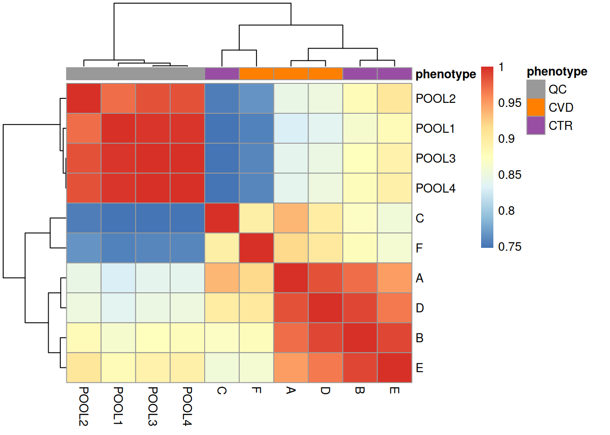

# Dataset investigation: What to do when you get your data

## Introduction

So, you (or your amazing lab mate) have finally finished the data
acquisition, and now you have a dataset in hand. What’s next?
Unfortunately, the work isn’t over yet. Before diving into any analysis,
it’s crucial to understand the dataset itself. This is the first step in
any data analysis workflow, ensuring that the data is of good quality
and is well-prepared for preprocessing and any downstream analysis you
plan to perform.

In this vignette, we present the dataset used throughout the different
vignettes of this website. It’s far from a *perfect* dataset, which
actually mirrors the reality of most datasets you’ll encounter in
research.

Some issues will indeed be specific to this described dataset. However,
the purpose of this vignette is to encourage you to think critically
about your data and guide you through steps that can help you avoid
spending hours on an analysis, only to realize later that some samples
or features should have been removed or flagged earlier on.

## Dataset Description

In this workflow, two datasets are used:

1.  An LC-MS-based (MS1 level only) untargeted metabolomics dataset to
    quantify small polar metabolites in human plasma samples.
2.  An additional LC-MS/MS dataset of selected samples from the former
    study for the identification and annotation of significant features.

The samples were randomly selected from a larger study aimed at
identifying metabolites with varying abundances between individuals
suffering from cardiovascular disease (CVD) and healthy controls (CTR).
The subset analyzed here includes data for three CVD patients, three CTR
individuals, and four quality control (QC) samples. The QC samples,
representing a pooled serum sample from a large cohort, were measured
repeatedly throughout the experiment to monitor signal stability.

The data and metadata for this workflow are available on the
MetaboLights database under the ID: MTBLS8735.

The detailed materials and methods used for the sample analysis are also
available in the MetaboLights entry. This is particularly important for
understanding the analysis and the parameters used. It should be noted
that the samples were analyzed using ultra-high-performance liquid
chromatography (UHPLC) coupled to a Q-TOF mass spectrometer (TripleTOF
5600+), and chromatographic separation was achieved using hydrophilic
interaction liquid chromatography (HILIC).

- Provide more in-depth visualizations to explore and understand the
  dataset quality.
- Compare pool lc-ms and pool lc-ms/ms and show that we have better
  separation on the second run.

## Package

``` r

## Data Import and handling
library(MsExperiment)
library(MsIO)
library(MsBackendMetaboLights)
library(SummarizedExperiment)

## Preprocessing of LC-MS data
library(xcms)
library(Spectra)
library(MetaboCoreUtils)
library(Biobase)

## Visualisation
library(pander)
library(RColorBrewer)
library(pheatmap)
```

## MS1 level data

We first load the raw data from MetaboLights:

``` r

param <- MetaboLightsParam(mtblsId = "MTBLS8735",
                           assayName = paste0("a_MTBLS8735_LC-MS_positive_",
                                              "hilic_metabolite_profiling.txt"),
                           filePattern = ".mzML")

lcms1 <- readMsObject(MsExperiment(),
                      param,
                      keepOntology = FALSE,
                      keepProtocol = FALSE,
                      simplify = TRUE)
```

We set up parallel processing to facilitate futher computations.

``` r

#' Set up parallel processing using 2 cores
if (.Platform$OS.type == "unix") {
    register(MulticoreParam(2))
} else {
    register(SnowParam(2))
}
```

We update the metadata to make the column names easier to access:

``` r

# Let's rename the column for easier access
colnames(sampleData(lcms1)) <- c("sample_name", "derived_spectra_data_file",
                                "metabolite_asssignment_file",
                                "source_name",
                                "organism",
                                "blood_sample_type",
                                "sample_type", "age", "unit", "phenotype")

# Add "QC" to the phenotype of the QC samples
qc_idx <- sampleData(lcms1)$sample_name == "POOL"
sampleData(lcms1)$phenotype[qc_idx] <- "QC"
sampleData(lcms1)$sample_name[qc_idx] <- c("POOL1", "POOL2", "POOL3", "POOL4")

#  Add injection index column
sampleData(lcms1)$injection_index <- seq_len(nrow(sampleData(lcms1)))

#let's look at the updated sample data
sampleData(lcms1)[, c("derived_spectra_data_file",
                     "phenotype", "sample_name", "age",
                     "injection_index")] |>
    kable(format = "pipe")
```

| derived_spectra_data_file   | phenotype | sample_name | age | injection_index |
|:----------------------------|:----------|:------------|----:|----------------:|
| FILES/MS_QC_POOL_1_POS.mzML | QC        | POOL1       |  NA |               1 |
| FILES/MS_A_POS.mzML         | CVD       | A           |  53 |               2 |
| FILES/MS_B_POS.mzML         | CTR       | B           |  30 |               3 |
| FILES/MS_QC_POOL_2_POS.mzML | QC        | POOL2       |  NA |               4 |
| FILES/MS_C_POS.mzML         | CTR       | C           |  66 |               5 |
| FILES/MS_D_POS.mzML         | CVD       | D           |  36 |               6 |
| FILES/MS_QC_POOL_3_POS.mzML | QC        | POOL3       |  NA |               7 |
| FILES/MS_E_POS.mzML         | CTR       | E           |  66 |               8 |
| FILES/MS_F_POS.mzML         | CVD       | F           |  44 |               9 |
| FILES/MS_QC_POOL_4_POS.mzML | QC        | POOL4       |  NA |              10 |

Table 2. Simplified sample data. {.table .caption-top
style="width:100%;"}

``` r

#' Define colors for the different phenotypes
col_phenotype <- brewer.pal(9, name = "Set1")[c(9, 5, 4)]
names(col_phenotype) <- c("QC", # grey
                          "CVD", # orange
                          "CTR") # purple
col_sample <- col_phenotype[sampleData(lcms1)$phenotype]
```

### Spectra exploration

Quick reminder that we access the spectra data as below:

``` r

#' Access Spectra Object
spectra(lcms1)
```

    MSn data (Spectra) with 17210 spectra in a MsBackendMetaboLights backend:
            msLevel     rtime scanIndex
          <integer> <numeric> <integer>
    1             1     0.274         1
    2             1     0.553         2
    3             1     0.832         3
    4             1     1.111         4
    5             1     1.390         5
    ...         ...       ...       ...
    17206         1   479.052      1717
    17207         1   479.331      1718
    17208         1   479.610      1719
    17209         1   479.889      1720
    17210         1   480.168      1721
     ... 37 more variables/columns.

    file(s):
    MS_QC_POOL_1_POS.mzML
    MS_A_POS.mzML
    MS_B_POS.mzML
     ... 7 more files

One of the first check that should be done is evaluatating the number of
spectra per sample. Below we summarize the number of spectra and their
respective MS level (extracted with the
[`msLevel()`](https://rdrr.io/pkg/ProtGenerics/man/protgenerics.html)
function). The `fromFile()` function returns for each spectrum the index
of its sample (data file) and can thus be used to split the information
(MS level in this case) by sample to further summarize using the base R
[`table()`](https://rdrr.io/pkg/BiocGenerics/man/table.html) function
and combine the result into a matrix.

``` r

#' Count the number of spectra with a specific MS level per file.
spectra(lcms1) |>
    msLevel() |>
    split(fromFile(lcms1)) |>
    lapply(table) |>
    do.call(what = cbind)
```

         1    2    3    4    5    6    7    8    9   10
    1 1721 1721 1721 1721 1721 1721 1721 1721 1721 1721

The present data set thus contains only MS1 data, which is ideal for
quantification of the signal. A second (LC-MS/MS) data set also with
fragment (MS2) spectra of the same samples will be used later on in the
workflow. We also cannot see any large difference in number of spectra
between the samples, which is a good sign that the data is of good
quality. If one sample had a significantly lower number of spectra, it
would be a sign of a potential issue with the sample.

Data obtained from LC-MS experiments are typically analyzed along the
retention time axis, while MS data is organized by spectrum, orthogonal
to the retention time axis. As another example, we below determine the
retention time range for the entire data set.

``` r

#' Retention time range for entire dataset
spectra(lcms1) |>
    rtime() |>
    range()
```

    [1]   0.273 480.169

## Data visualization and general quality assessment

Effective visualization is paramount for inspecting and assessing the
quality of MS data. For a general overview of our LC-MS data, we can:

- Combine all mass peaks from all (MS1) spectra of a sample into a
  single spectrum in which each mass peak then represents the maximum
  signal of all mass peaks with a similar *m/z*. This spectrum might
  then be called Base Peak Spectrum (BPS), providing information on the
  most abundant ions of a sample.
- Aggregate mass peak intensities for each spectrum, resulting in the
  Base Peak Chromatogram (BPC). The BPC shows the highest measured
  intensity for each distinct retention time (hence spectrum) and is
  thus orthogonal to the BPS.
- Sum the mass peak intensities for each spectrum to create a Total Ion
  Chromatogram (TIC).
- Compare the BPS of all samples in an experiment to evaluate similarity
  of their ion content.
- Compare the BPC of all samples in an experiment to identify samples
  with similar or dissimilar chromatographic signal.

In addition to such general data evaluation and visualization, it is
also crucial to investigate specific signal of e.g. internal standards
or compounds/ions known to be present in the samples. By providing a
reliable reference, internal standards help achieve consistent and
accurate analytical results.

### Spectra Data Visualization: BPS

The BPS collapses data in the retention time dimension and reveals the
most prevalent ions present in each of the samples, creation of such BPS
is however not straightforward. Mass peaks, even if representing signals
from the same ion, will never have identical *m/z* values in consecutive
spectra due to the measurement error/resolution of the instrument.

Below we use the `combineSpectra` function to combine all spectra from
one file (defined using parameter `f = fromFile(data)`) into a single
spectrum. All mass peaks with a difference in *m/z* value smaller than 3
parts-per-million (ppm) are combined into one mass peak, with an
intensity representing the maximum of all such grouped mass peaks. To
reduce memory requirement, we in addition first *bin* each spectrum
combining all mass peaks within a spectrum, aggregating mass peaks into
bins with 0.01 *m/z* width. In case of large datasets, it is also
recommended to set the
[`processingChunkSize()`](https://rdrr.io/pkg/ProtGenerics/man/processingQueue.html)
parameter of the `MsExperiment` object to a finite value (default is
`Inf`) causing the data to be processed (and loaded into memory) in
chunks of
[`processingChunkSize()`](https://rdrr.io/pkg/ProtGenerics/man/processingQueue.html)
spectra. This can reduce memory demand and speed up the process.

``` r

#' Setting the chunksize
chunksize <- 1000
processingChunkSize(spectra(lcms1)) <- chunksize
```

We can now generate BPS for each sample and
[`plot()`](https://rdrr.io/r/graphics/plot.default.html) them.

``` r

#' Combining all spectra per file into a single spectrum
bps <- spectra(lcms1) |>
    bin(binSize = 0.01) |>
    combineSpectra(f = fromFile(lcms1), intensityFun = max, ppm = 3)

#' Plot the base peak spectra
par(mar = c(2, 1, 1, 1))
plotSpectra(bps, main= "")
```


Figure 1. BPS of all samples.

Here, there is observable overlap in ion content between the files,
particularly around 300 *m/z* and 700 *m/z*. There are however also
differences between sets of samples. In particular, BPS 1, 4, 7 and 10
(counting row-wise from left to right) seem different than the others.
In fact, these four BPS are from QC samples, and the remaining six from
the study samples. The observed differences might be explained by the
fact that the QC samples are pools of serum samples from a different
cohort, while the study samples represent plasma samples, from a
different sample collection.

Next to the visual inspection above, we can also calculate and express
the similarity between the BPS with a heatmap. Below we use the
[`compareSpectra()`](https://rdrr.io/pkg/ProtGenerics/man/protgenerics.html)
function to calculate pairwise similarities between all BPS and use then
the [`pheatmap()`](https://rdrr.io/pkg/pheatmap/man/pheatmap.html)
function from the *pheatmap* package to cluster and visualize this
result.

``` r

#' Calculate similarities between BPS
sim_matrix <- compareSpectra(bps)

#' Add sample names as rownames and colnames
rownames(sim_matrix) <- colnames(sim_matrix) <- sampleData(lcms1)$sample_name
ann <- data.frame(phenotype = sampleData(lcms1)[, "phenotype"])
rownames(ann) <- rownames(sim_matrix)

#' Plot the heatmap
pheatmap(sim_matrix, annotation_col = ann,
         annotation_colors = list(phenotype = col_phenotype))
```


Figure 2. Heatmap of MS signals similarities.

We get a first glance at how our different samples distribute in terms
of similarity. The heatmap confirms the observations made with the BPS,
showing distinct clusters for the QCs and the study samples, owing to
the different matrices and sample collections.

It is also strongly recommended to delve deeper into the data by
exploring it in more detail. This can be accomplished by carefully
assessing our data and extracting spectra or regions of interest for
further examination. In the next chunk, we will look at how to extract
information for a specific spectrum from distinct samples.

``` r

#' Accessing a single spectrum - comparing with QC
par(mfrow = c(1,2), mar = c(2, 2, 2, 2))
spec1 <- spectra(lcms1[1])[125]
spec2 <- spectra(lcms1[3])[125]
plotSpectra(spec1, main = "QC sample")
plotSpectra(spec2, main = "CTR sample")
```


Figure 3. Intensity and m/z values of the 125th spectrum of two CTR
samples.

The significant dissimilarities in peak distribution and intensity
confirm the difference in composition between QCs and study samples. We
next compare a full MS1 spectrum from a CVD and a CTR sample.

``` r

#' Accessing a single spectrum - comparing CVD and CTR
par(mfrow = c(1,2), mar = c(2, 2, 2, 2))
spec1 <- spectra(lcms1[2])[125]
spec2 <- spectra(lcms1[3])[125]
plotSpectra(spec1, main = "CVD sample")
plotSpectra(spec2, main = "CTR sample")
```


Figure 4. Intensity and m/z values of the 125th spectrum of one CVD and
one CTR sample.

Above, we can observe that the spectra between CVD and CTR samples are
not entirely similar, but they do exhibit similar main peaks between 200
and 600 m/z with a general higher intensity in control samples. However
the peak distribution (or at least intensity) seems to vary the most
between an *m/z* of 10 to 210 and after an *m/z* of 600.

The CTR spectrum above exhibits significant peaks around an *m/z* of
150 - 200 that have a much lower intensity in the CVD sample. To delve
into more details about this specific spectrum, a wide range of
functions can be employed:

``` r

#' Checking its intensity
intensity(spec2)
```

    NumericList of length 1
    [[1]] 18.3266733266736 45.1666666666667 ... 27.1048951048951 34.9020979020979

``` r

#' Checking its rtime
rtime(spec2)
```

    [1] 34.872

``` r

#' Checking its m/z
mz(spec2)
```

    NumericList of length 1
    [[1]] 51.1677328505635 53.0461968245186 ... 999.139446289161 999.315208803072

``` r

#' Filtering for a specific m/z range and viewing in a tabular format
filt_spec <- filterMzRange(spec2,c(50,200))

data.frame(intensity = unlist(intensity(filt_spec)),
           mz = unlist(mz(filt_spec))) |>
  head() |> kable(format = "markdown")
```

|  intensity |       mz |
|-----------:|---------:|
|   18.32667 | 51.16773 |
|   45.16667 | 53.04620 |
|   23.07692 | 53.70114 |
|   41.36364 | 53.84408 |
|   32.86713 | 53.88130 |
| 1159.03030 | 54.01002 |

Table 3. Intensity and m/z values of the 125th spectrum of one CTR
sample. {.table .caption-top}

### Chromatographic info

``` r

#' Filter the data based on retention time
lcms1 <- filterRt(lcms1, c(10, 240))
```

    Filter spectra

``` r

bpc <- chromatogram(lcms1, aggregationFun = "max")

#' Plot after filtering
plot(bpc, col = paste0(col_sample, 80),
     main = "BPC after filtering retention time", lwd = 1.5)
grid()
legend("topright", col = col_phenotype,
       legend = names(col_phenotype), lty = 1, lwd = 2, horiz = TRUE, bty = "n")
```


Figure 6. BPC after filtering retention time.

Initially, we examined the entire BPC and subsequently filtered it based
on the desired retention times. This not only results in a smaller file
size but also facilitates a more straightforward interpretation of the
BPC.

The final plot illustrates the BPC for each sample colored by phenotype,
providing insights on the signal measured along the retention times of
each sample. It reveals the points at which compounds eluted from the LC
column. In essence, a BPC condenses the three-dimensional LC-MS data
(*m/z* by retention time by intensity) into two dimensions (retention
time by intensity).

We can also here compare similarities of the BPCs in a heatmap. The
retention times will however not be identical between different samples.
Thus we *bin()* the chromatographic signal per sample along the
retention time axis into bins of two seconds resulting in data with the
same number of bins/data points. We can then calculate pairwise
similarities between these data vectors using the
[`cor()`](https://rdrr.io/r/stats/cor.html) function and visualize the
result using
[`pheatmap()`](https://rdrr.io/pkg/pheatmap/man/pheatmap.html).

``` r

#' Total ion chromatogram
tic <- chromatogram(lcms1, aggregationFun = "sum") |>
  bin(binSize = 2)

#' Calculate similarity (Pearson correlation) between BPCs
ticmap <- do.call(cbind, lapply(tic, intensity)) |>
  cor()

rownames(ticmap) <- colnames(ticmap) <- sampleData(lcms1)$sample_name
ann <- data.frame(phenotype = sampleData(lcms1)[, "phenotype"])
rownames(ann) <- rownames(ticmap)

#' Plot heatmap
pheatmap(ticmap, annotation_col = ann,
         annotation_colors = list(phenotype = col_phenotype))
```



Figure 7. Heatmap of BPC similarities.

The heatmap above reinforces what our exploration of spectra data
showed, which is a strong separation between the QC and study samples.
This is important to bear in mind for later analyses.

Additionally, study samples group into two clusters, cluster *I*
containing samples *C* and *F* and cluster *II* with all other samples.
Below we plot the TIC of all samples, using a different color for each
cluster.

``` r

cluster_I_idx <- sampleData(lcms1)$sample_name %in% c("F", "C")
cluster_II_idx <- sampleData(lcms1)$sample_name %in% c("A", "B", "D", "E")

temp_col <- c("grey", "red")
names(temp_col) <- c("Cluster II", "Cluster I")
col <- rep(temp_col[1], length(lcms1))
col[cluster_I_idx] <- temp_col[2]
col[sampleData(lcms1)$phenotype == "QC"] <- NA

lcms1 |>
    chromatogram(aggregationFun = "sum") |>
    plot( col = col,
     main = "TIC after filtering retention time", lwd = 1.5)
grid()
legend("topright", col = temp_col,
       legend = names(temp_col), lty = 1, lwd = 2,
       horiz = TRUE, bty = "n")
```


Figure 8. Example of TIC of unusual signal.

While the TIC of all samples look similar, the samples from cluster I
show a different signal in the retention time range from about 40 to 160
seconds. Whether, and how strong this difference will impact the
following analysis remains to be determined.

### known compounds

While the artificially isotope labeled compounds were spiked to the
individual samples, there should also be the signal from the endogenous
compounds in serum (or plasma) samples. Thus, we calculate next the mass
and *m/z* of an *\[M+H\]+* ion of the endogenous cystine from its
chemical formula and extract also the EIC from this ion. For calculation
of the exact mass and the *m/z* of the selected ion adduct we use the
[`calculateMass()`](https://rdrr.io/pkg/MetaboCoreUtils/man/calculateMass.html)
and [`mass2mz()`](https://rdrr.io/pkg/MetaboCoreUtils/man/mass2mz.html)
functions from the
*[MetaboCoreUtils](https://bioconductor.org/packages/3.22/MetaboCoreUtils)*
package.

``` r

#' extract endogenous cystine mass and EIC and plot.
cysmass <- calculateMass("C6H12N2O4S2")
cys_endo <- mass2mz(cysmass, adduct = "[M+H]+")[, 1]
eic_cys_endo <- chromatogram(lcms1, mz = cys_endo + c(-0.005, 0.005),
                             rt = c(199, 219), aggregationFun = "max")
eic_cys_spiked <-  chromatogram(lcms1 , mz = c(249.040276, 249.050276),
                                rt = c(199,219))

#' Plot versus spiked
par(mfrow = c(1, 2))
plot(eic_cys_endo, col = paste0(col_sample, 80))
grid()

plot(eic_cys_spiked, col = paste0(col_sample, 80))
grid()
legend("topright", col = col_phenotype, legend = names(col_phenotype),
       lty = 1, bty = "n")
```


Figure 9. EIC of endogenous cystine vs spiked.

The two cystine EICs above look highly similar (the endogenous shown
left, the isotope labeled right in the plot above), if not for the shift
in m/z, which arises from the artificial labeling. This shift allows us
to discriminate between the endogenous and non-endogenous compound.

### Further post-processing analysis

Below we load the `lcms1` object that we saved after preprocessing.

``` r

# load preprocessed xcmsExperiment
lcms1 <- readMsObject(XcmsExperiment(),
    AlabasterParam(system.file("extdata", "preprocessed_lcms1",
                               package = "Metabonaut")))

res <- readObject(system.file("extdata", "preprocessed_res",
                               package = "Metabonaut"))
```

### Noise analysis

Below we plot the backgrounds signal for each study group. This can be
interesting in cases on technical evaluation. In our cases we expect
very similar background noise in both CVD and CTR.

``` r

# overall signal in the dataset
#' - for each file calculate the sum of intensities
background  <- spectra(lcms1) |>
    split(fromFile(lcms1)) |>
    lapply(tic) |>
    lapply(sum) |>
    unlist()

# Overall signal that is in the chromatographic peaks detection
detected <- apply(assay(res), 2, function(x) sum(x, na.rm = TRUE))

names(background) <- names(detected) <- res$phenotype
idx_qc <- sampleData(lcms1)$phenotype == "QC"
noise <- background[!idx_qc] - detected[!idx_qc]

f <- factor(names(noise), levels = unique(names(noise)))
group <- split(log2(noise), f)

plot(NULL, xlim = c(1, length(group)), ylim = range(unlist(group)),
     xaxt = "n", xlab = "Devices", ylab = "Noise",
     main = "log2 background signal comparison between study group")
for (i in seq_along(group)) {
  points(rep(i, length(group[[i]])), group[[i]], pch = 19)
}
axis(1, at = seq_along(group), labels = names(group))
```


Figure 10. Evaluation of background signal.

There seems to be more background noise in the CVD samples…

More coming soon…

### Evaluating MS *foreground* and *background* signal

The difference between *background* and *foreground* signal of MS data
files can also provide insights into data quality. Defining the
*background* signal in an MS data file is however not trivial. The
*foreground* signal could be defined as the biologically relevant or
interesting signal while the noise or an offset/continuous signal could
be defined as *background* signal. For LC-MS experiments *foreground*
could be the signal of the measured compounds’ ions, i.e., the
identified chromatographic peaks. Background signal could then be the
full signal *minus* this foreground signal.

In the example below we evaluate this data for the first sample. We thus
subset the *xcms* preprocessing result `lcms1` to the first sample and
apply the
[`filterPeaksRanges()`](https://rdrr.io/pkg/Spectra/man/filterPeaksRanges.html)
filter function to the `Spectra` object within that. As filters we use
the *m/z* and retention time ranges of the chromatographic peaks of the
first sample. We further expand the *m/z* range by 3ppm on each side
since the reported `"mzmin"` and `"mzmax"` values from the *centWave*
peak detection seemed to underestimate the actual *m/z* peak width
slightly. Increasing *m/z* peak width by such a small value is not
problematic for centroided data but it ensures the estimated
*background* signal to not contain any *foreground* peak signals.

Using the `keep` parameter of the
[`filterPeaksRanges()`](https://rdrr.io/pkg/Spectra/man/filterPeaksRanges.html)
function it is possible to define whether the mass peaks matching the
specified filters are kept or removed. We can thus keep or remove all
mass peaks of the identified chromatographic peaks to define the
foreground or background signal, respectively.

``` r

one <- lcms1[1L]

#' Define the m/z-rt areas for chromatographic peaks and expand them by 3ppm
peak_ranges <- chromPeaks(one)[, c("mzmin", "mzmax", "rtmin", "rtmax")]
peak_ranges[, "mzmin"] <- peak_ranges[, "mzmin"] -
    MsCoreUtils::ppm(peak_ranges[, "mzmin"], 3)
peak_ranges[, "mzmax"] <- peak_ranges[, "mzmax"] +
    MsCoreUtils::ppm(peak_ranges[, "mzmax"], 3)

#' Filter spectra keeping only mass peaks within the peak areas
one_fg <- filterSpectra(one, filterPeaksRanges,
                        mz = peak_ranges[, c("mzmin", "mzmax")],
                        rtime = peak_ranges[, c("rtmin", "rtmax")],
                        keep = TRUE)
#' Filter spectra removing mass peaks within the peak areas
one_bg <- filterSpectra(one, filterPeaksRanges,
                        mz = peak_ranges[, c("mzmin", "mzmax")],
                        rtime = peak_ranges[, c("rtmin", "rtmax")],
                        keep = FALSE)
```

The MS data of the `one_fg` variable contains now only mass peaks that
are **within** the chromatographic peaks of that sample, and the
`one_bg` variable the mass peaks **outside** of the chromatographic
peaks. To illustrate this we plot below first the full MS data for a
retention time and *m/z* range containing also the signal of a
methionine ion. The lower panel of the plot contains the individual mass
peaks in the region with their intensity color-coded. The area of
identified chromatographic peaks is indicated with red rectangles. The
upper panel shows the TIC signal of the data shown in the lower panel.

``` r

filterSpectra(one, filterRt, c(145, 175)) |>
    filterSpectra(filterMzRange, c(150, 160)) |>
    plot()
```


Figure 11. Full MS data for a retention time region rfom 145-175 seconds
and an m/z range from 150-160.

The same plot, but for the *foreground* signal defined above:

``` r

filterSpectra(one_fg, filterRt, c(145, 175)) |>
    filterSpectra(filterMzRange, c(150, 160)) |>
    plot()
```


Figure 12. Mass peaks within chromatographic peak areas.

And the same for the *background* signal.

``` r

filterSpectra(one_bg, filterRt, c(145, 175)) |>
    filterSpectra(filterMzRange, c(150, 160)) |>
    plot()
```


Figure 13. Mass peaks outside chromatographic peak areas.

These plots show the effect of filtering the data set performed above -
the foreground-only data contains all mass peaks within the
chromatographic peak areas, while the background data contains (mostly)
low abundant (background) signal, or signal that was not defined as, or
included in, chromatographic peaks.

We can next extract the total ion chromatogram (TIC) from the full
original data as well as from the foreground and background-only data.

``` r

#' Extract TIC
tic <- chromatogram(one, aggregationFun = "sum", chromPeaks = "none")
```

    Extracting chromatographic data

``` r

tic_bg <- chromatogram(one_bg, aggregationFun = "sum", chromPeaks = "none")
```

    Extracting chromatographic data

``` r

tic_fg <- chromatogram(one_fg, aggregationFun = "sum", chromPeaks = "none")
```

    Extracting chromatographic data

``` r

par(mfrow = c(3, 1))
yl <- c(0, max(intensity(tic[[1L]])))
plot(tic, ylim = yl, main = "Total ion signal")
grid()
plot(tic_fg, ylim = yl, main = "Total foreground signal")
grid()
plot(tic_bg, ylim = yl, main = "Total background signal")
grid()
```


Figure 14. Comparison of total ion signal, total foreground signal and
total background signal.

For the present (QC) sample, the background signal is much lower than
the foreground signal.

To apply the same code on the full data set, we would need to filter in
addition to the *m/z* and retention times also for the specific data
file (`$dataOrigin`) of the chromatographic peak. For example, it would
be possible to add an additional spectra variable defining the sample
index and use this as an additional filter to the
[`filterPeaksRanges()`](https://rdrr.io/pkg/Spectra/man/filterPeaksRanges.html)
call:

``` r

cpks <- chromPeaks(lcms1)[, c("rtmin", "rtmax", "mzmin", "mzmax", "sample")]
spectra(lcms1)$sample_index <- spectraSampleIndex(lcms1)

lcms1_bg <- filterSpectra(
    lcms1, filterPeaksRanges,
    mz = cpks[, c("mzmin", "mzmax")],
    rtime = cpks[, c("rtmin", "rtmax")],
    sample_index = cbind(cpks[, "sample"] - 0.1, cpks[, "sample"] + 0.1),
    keep = FALSE)
```

It should however be noted that each individual filter (i.e., row in the
matrices provided with `mz` and `rtime`) is evaluated iteratively and
thus the performance of the filter step depends heavily on the number of
rows of these matrices.

## Session information

The R version and versions of packages used for this analysis are listed
below.

``` r

sessionInfo()
```

    R version 4.5.2 (2025-10-31)
    Platform: x86_64-pc-linux-gnu
    Running under: Ubuntu 24.04.3 LTS

    Matrix products: default
    BLAS:   /usr/lib/x86_64-linux-gnu/openblas-pthread/libblas.so.3
    LAPACK: /usr/lib/x86_64-linux-gnu/openblas-pthread/libopenblasp-r0.3.26.so;  LAPACK version 3.12.0

    locale:
     [1] LC_CTYPE=en_US.UTF-8       LC_NUMERIC=C
     [3] LC_TIME=en_US.UTF-8        LC_COLLATE=en_US.UTF-8
     [5] LC_MONETARY=en_US.UTF-8    LC_MESSAGES=en_US.UTF-8
     [7] LC_PAPER=en_US.UTF-8       LC_NAME=C
     [9] LC_ADDRESS=C               LC_TELEPHONE=C
    [11] LC_MEASUREMENT=en_US.UTF-8 LC_IDENTIFICATION=C

    time zone: Etc/UTC
    tzcode source: system (glibc)

    attached base packages:
    [1] stats4    stats     graphics  grDevices utils     datasets  methods
    [8] base

    other attached packages:
     [1] pheatmap_1.0.13             RColorBrewer_1.1-3
     [3] pander_0.6.6                MetaboCoreUtils_1.18.1
     [5] xcms_4.8.0                  SummarizedExperiment_1.40.0
     [7] Biobase_2.70.0              GenomicRanges_1.62.1
     [9] Seqinfo_1.0.0               IRanges_2.44.0
    [11] MatrixGenerics_1.22.0       matrixStats_1.5.0
    [13] MsBackendMetaboLights_1.5.1 Spectra_1.20.1
    [15] BiocParallel_1.44.0         S4Vectors_0.48.0
    [17] BiocGenerics_0.56.0         generics_0.1.4
    [19] MsIO_0.0.12                 MsExperiment_1.12.0
    [21] ProtGenerics_1.42.0         BiocStyle_2.38.0
    [23] quarto_1.5.1.9002           knitr_1.51

    loaded via a namespace (and not attached):
      [1] rstudioapi_0.17.1           jsonlite_2.0.0
      [3] MultiAssayExperiment_1.36.1 magrittr_2.0.4
      [5] farver_2.1.2                MALDIquant_1.22.3
      [7] rmarkdown_2.30              fs_1.6.6
      [9] vctrs_0.6.5                 memoise_2.0.1
     [11] htmltools_0.5.9             S4Arrays_1.10.1
     [13] BiocBaseUtils_1.12.0        progress_1.2.3
     [15] curl_7.0.0                  Rhdf5lib_1.32.0
     [17] SparseArray_1.10.8          rhdf5_2.54.1
     [19] mzID_1.48.0                 alabaster.base_1.10.0
     [21] plyr_1.8.9                  httr2_1.2.2
     [23] impute_1.84.0               cachem_1.1.0
     [25] igraph_2.2.1                lifecycle_1.0.4
     [27] iterators_1.0.14            pkgconfig_2.0.3
     [29] Matrix_1.7-4                R6_2.6.1
     [31] fastmap_1.2.0               clue_0.3-66
     [33] digest_0.6.39               pcaMethods_2.2.0
     [35] ps_1.9.1                    RSQLite_2.4.5
     [37] filelock_1.0.3              abind_1.4-8
     [39] compiler_4.5.2              withr_3.0.2
     [41] bit64_4.6.0-1               doParallel_1.0.17
     [43] S7_0.2.1                    DBI_1.2.3
     [45] alabaster.ranges_1.10.0     HDF5Array_1.38.0
     [47] alabaster.schemas_1.10.0    MASS_7.3-65
     [49] rappdirs_0.3.3              DelayedArray_0.36.0
     [51] mzR_2.44.0                  tools_4.5.2
     [53] PSMatch_1.14.0              otel_0.2.0
     [55] glue_1.8.0                  h5mread_1.2.1
     [57] QFeatures_1.20.0            rhdf5filters_1.22.0
     [59] grid_4.5.2                  cluster_2.1.8.1
     [61] reshape2_1.4.5              gtable_0.3.6
     [63] preprocessCore_1.72.0       tidyr_1.3.2
     [65] data.table_1.18.0           hms_1.1.4
     [67] XVector_0.50.0              foreach_1.5.2
     [69] pillar_1.11.1               stringr_1.6.0
     [71] limma_3.66.0                later_1.4.4
     [73] dplyr_1.1.4                 BiocFileCache_3.0.0
     [75] lattice_0.22-7              bit_4.6.0
     [77] tidyselect_1.2.1            xfun_0.55
     [79] statmod_1.5.1               MSnbase_2.36.0
     [81] stringi_1.8.7               lazyeval_0.2.2
     [83] yaml_2.3.12                 evaluate_1.0.5
     [85] codetools_0.2-20            MsCoreUtils_1.22.1
     [87] tibble_3.3.0                alabaster.matrix_1.10.0
     [89] BiocManager_1.30.27         cli_3.6.5
     [91] affyio_1.80.0               processx_3.8.6
     [93] Rcpp_1.1.0                  MassSpecWavelet_1.76.0
     [95] dbplyr_2.5.1                XML_3.99-0.20
     [97] parallel_4.5.2              ggplot2_4.0.1
     [99] blob_1.2.4                  prettyunits_1.2.0
    [101] AnnotationFilter_1.34.0     alabaster.se_1.10.0
    [103] MsFeatures_1.18.0           scales_1.4.0
    [105] affy_1.88.0                 ncdf4_1.24
    [107] purrr_1.2.0                 crayon_1.5.3
    [109] rlang_1.1.6                 vsn_3.78.0                 
