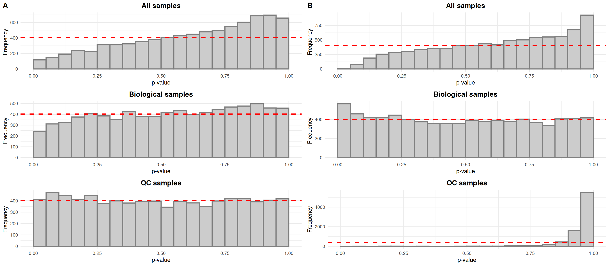
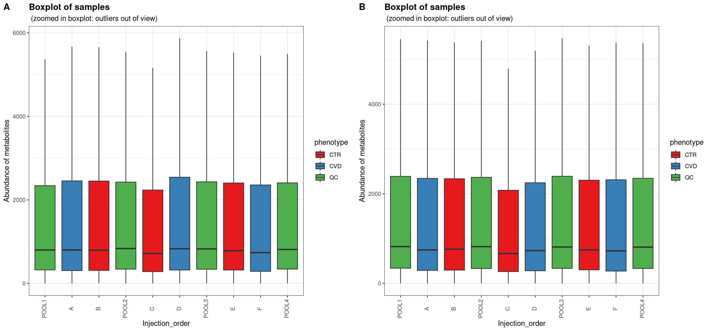
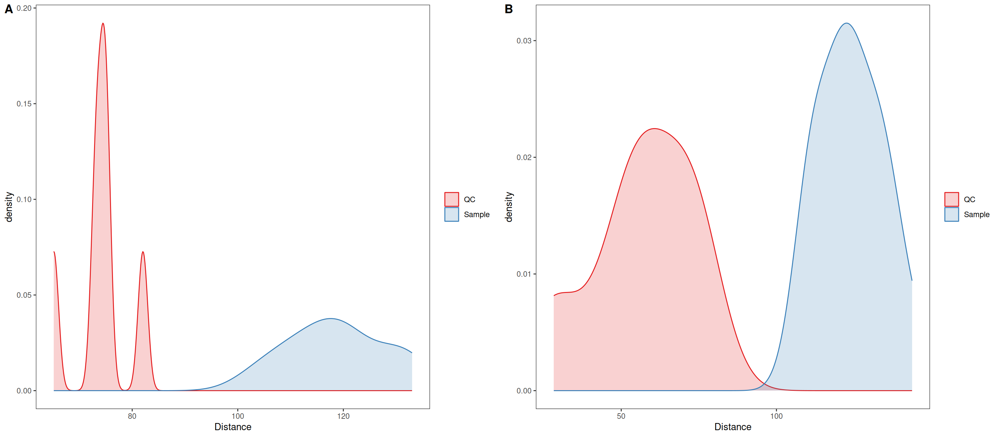
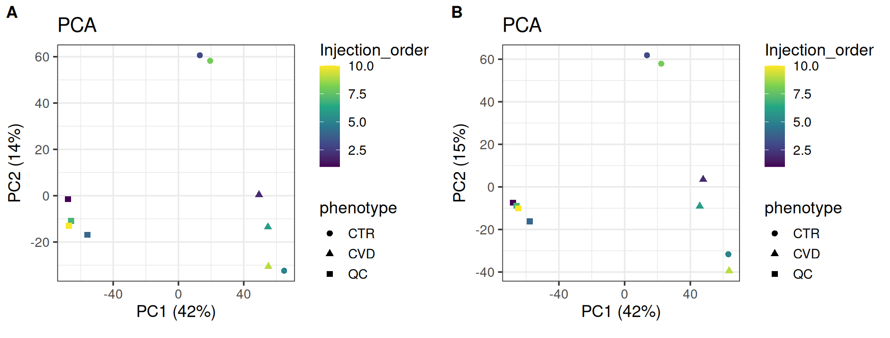
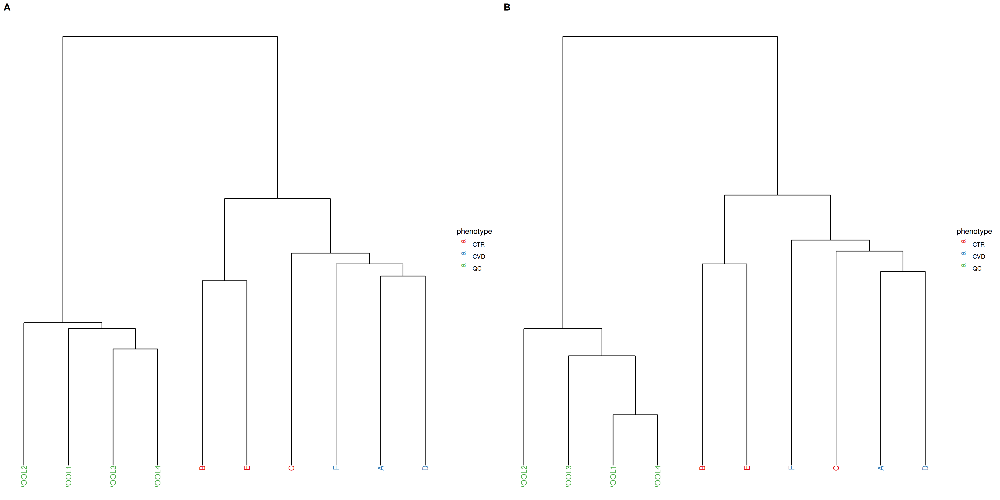
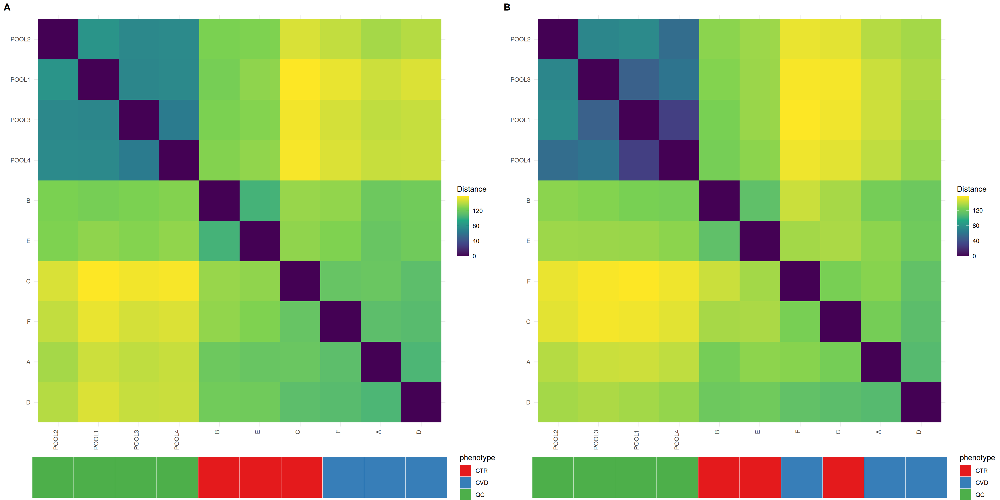
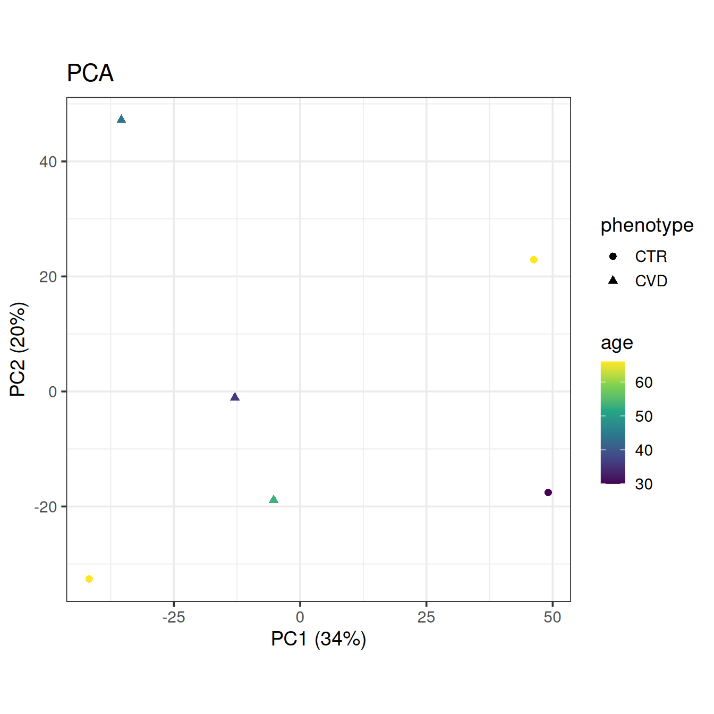
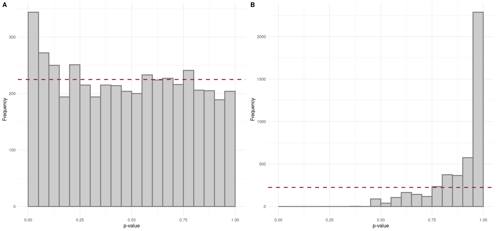
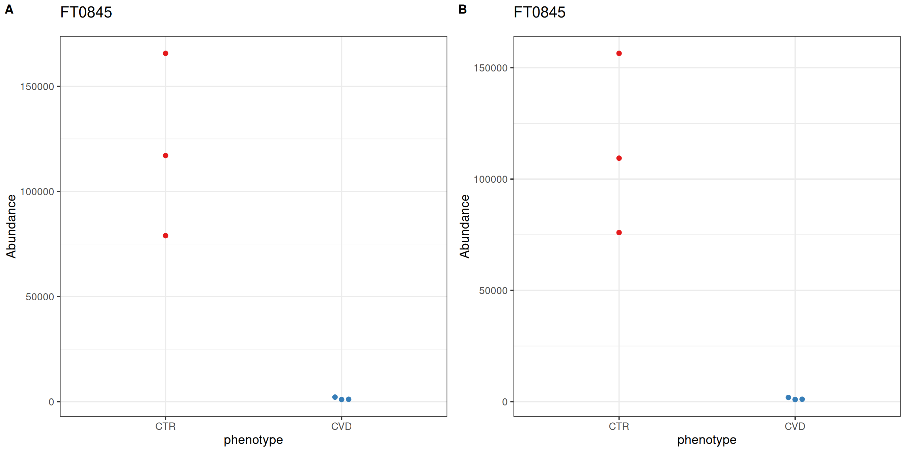
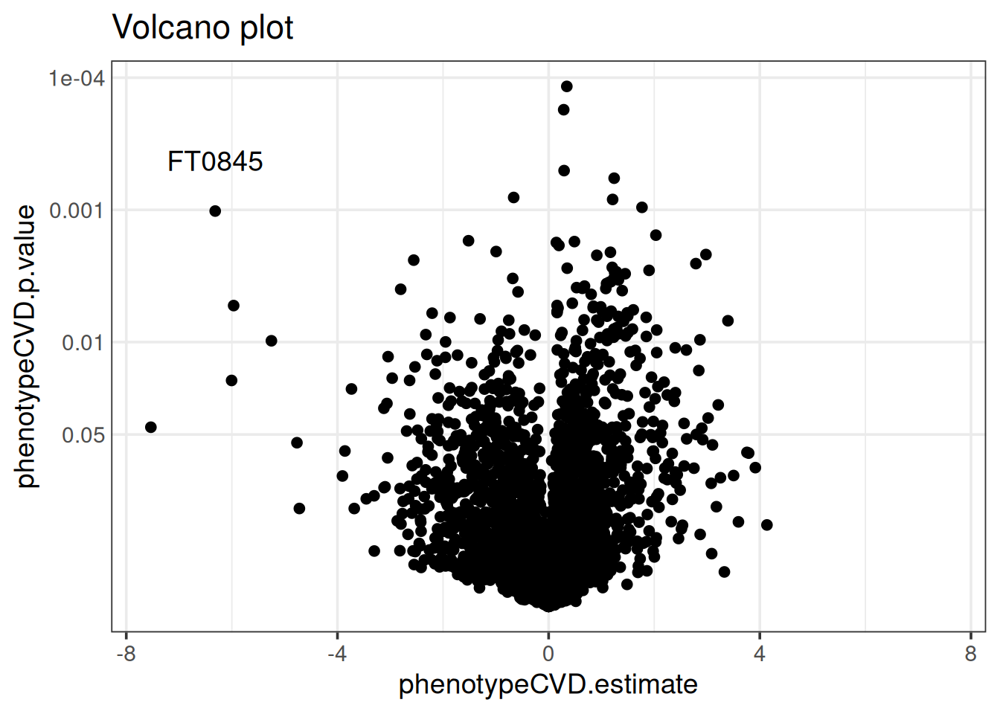

# Normalization and feature selection with the notame package

## Introduction

Herein, we will perform normalization and feature selection using the
*notame* R packages, originally developed in parallel with a protocol
article published in the “Metabolomics Data Processing and Data
Analysis—Current Best Practices” special issue of the Metabolites
journal ([Klåvus et al. 2020](#ref-klavus_notame_2020)). The main
outcome is identifying interesting features for laborious downstream
steps relating to biological context, such as annotation and pathway
analysis, which fall outside the purview of *notame*. The associated
protocol article presents a sequence of steps that is easily adopted by
new practitioners. We will not follow the protocol article exactly and
instead do an analysis which meshes with the trunk of the end-to- end
Metabonaut workflow.

The normalization process is based on QC samples so the sample size here
is limiting, with only four QC samples. The QC samples were also pooled
from another sample collection, whereas typically, the QC samples would
be pooled from the same sample collection. These limitations will become
evident below, so we make an effort to explain the basic things one
would want to look out for.

## Setup

Let’s prepare by attaching packages and loading the preprocessed data as
a SummarizedExperiment object returned from `MSExperiment::quantify()`.

``` r

library(alabaster.se) # Portable loading and saving of SummarizedExperiment
library(BiocParallel) # Parallelization
library(cowplot) # Combinine plots in pane
library(limma) # Differential expression analysis
library(notame) # Preprocessing
library(notameViz) # Visualization
library(notameStats) # Feature selection
library(SummarizedExperiment) # The SummarizedExperiment container

# Set up parallel processing using 2 cores
if (.Platform$OS.type == "unix") {
    register(MulticoreParam(10))
} else {
    register(SnowParam(2))
}

dir <- system.file("extdata", "preprocessed_res", package = "Metabonaut")
se <- readObject(dir)
se
```

    class: SummarizedExperiment
    dim: 9068 10
    metadata(0):
    assays(2): raw raw_filled
    rownames(9068): FT0001 FT0002 ... FT9067 FT9068
    rowData names(11): mzmed mzmin ... QC ms_level
    colnames(10): MS_QC_POOL_1_POS.mzML MS_A_POS.mzML ... MS_F_POS.mzML
      MS_QC_POOL_4_POS.mzML
    colData names(11): sample_name derived_spectra_data_file ... phenotype
      injection_index

The `SummarizedExperiment` container supports several assays. In
*notame*, you need to specify the assay using the `assay.type` parameter
if using multiple assays. Herein, we have two assays: “raw” contains the
detected peaks without gap-filling, whereas “raw_filled” contains the
gap-filled peak table. For this demo to go smoothly, we prepare the
SummarizedExperiment object for all the functions at once, mostly by
renaming and creating columns.

``` r

# Rename columns of sample data
rename_ind <- which(colnames(colData(se)) %in%
                    c("sample_name", "sample_type", "injection_index"))
colnames(colData(se))[rename_ind] <- c("Sample_ID", "QC", "Injection_order")
# Change rownames to be identical with "Sample_ID" column
colnames(se) <- colData(se)$Sample_ID
# Change name of pooled samples to "QC" in the "QC" column
se$QC[se$QC == "pool"] <- "QC"
# Convert phenotype column to factor
se$phenotype <- as.factor(se$phenotype)

# In feature data, create Feature_ID column from rownames
rowData(se) <- cbind(Feature_ID = rownames(se), rowData(se))
# Create "Split" column with analytical mode
rowData(se)$Split <- "HILIC_pos"
# Create "Flag" column for flagging low-quality features
rowData(se)$Flag <- NA

# Convert assay from DelayedMatrix to regular matrix
assay(se, "raw_filled") <- as.matrix(assay(se, "raw_filled"))
assay(se, "raw") <- as.matrix(assay(se, "raw"))
```

## Normalization

Features with a low detection rate are flagged, as they are deemed too
unreliable not only for statistical analysis, but also for the
normalization process which relies heavily on QC samples. Flagged
features are automatically excluded in most functions in *notame*, but
can be included using `all_features = TRUE`. We set the detection rate
threshold for QC samples at 70% ([Broadhurst et al.
2018](#ref-broadhurst_guidelines_2018)), plus a within-group threshold
of 80%. The within-group threshold must be met in at least one study
group.

``` r

se <- flag_detection(se, qc_limit = 0.7, group_limit = 0.8,
                     group = "phenotype", assay.type = "raw_filled")
```

    INFO [2025-12-12 13:16:36]
    11% of features flagged for low detection rate

Next, we correct for drift using a cubic spline, relating each features’
abundance in QC samples to injection order ([Kirwan et al.
2013](#ref-kirwan_characterising_2013)). Drift correction is performed
in log-space since the log transformed data better follows assumptions
of cubic spline regression. The value for the smoothing parameter is, by
default, optimized using leave-one-out cross-validation to avoid
overfitting. The abundances are corrected by adding the mean of a
feature’s abundance in the QC samples and subtracting the predicted fit
for each feature.

``` r

se <- correct_drift(se, assay.type = "raw_filled", name = "drift_norm")
```

    INFO [2025-12-12 13:16:36] Starting drift correction
    INFO [2025-12-12 13:16:44] Recomputing quality metrics for drift corrected data
    INFO [2025-12-12 13:16:46] Drift correction performed
    INFO [2025-12-12 13:16:46] Inspecting drift correction results
    INFO [2025-12-12 13:16:46] Original quality metrics missing, recomputing
    INFO [2025-12-12 13:16:48] Drift correction results inspected: Drift_corrected: 94%,  Missing_QCS: 6%

Brief notes about drift correction are stored in the `DC_note` column of
feature data. For example, it is noted if drift correction couldn’t be
performed because because at least four QC samples with values are
needed for fitting the cubic spline.

Next, we apply probabilistic quotient normalization (PQN) to reduce
unwanted variation from differential dilution of samples ([Dieterle et
al. 2006](#ref-dieterle_probabilistic_2006)). The central challenge here
is to reduce unwanted variation from dilution, whether biological or
experimental, while accounting for the possibility of biologically
meaningful variation in total feature abundances. In probabilistic
quotient normalization, the most probable dilution factor is determined
for each sample as the median of quotients calculated for each feature
relative to the median of each feature’s abundance in reference samples.
The sample abundances are then divided by the dilution factor. Below, we
use quality features in QC samples as reference, although the literature
suggests that the choice of reference samples isn’t critical ([Dieterle
et al. 2006](#ref-dieterle_probabilistic_2006)).

``` r

se <- pqn_normalization(se, ref = "qc", method = "median",
                        assay.type = "drift_norm", name = "dil_norm")
```

    INFO [2025-12-12 13:16:48] Starting PQN normalization
    INFO [2025-12-12 13:16:48] Using median of qc samples as reference spectrum

Next, let’s visualize the data before and after normalization for drift
and dilution using the *notameViz* package. Typically, the data would be
assessed visually after each step of the normalization process, using
the
[`save_QC_plots()`](https://rdrr.io/pkg/notameViz/man/save_QC_plots.html)
wrapper to save relevant plots. Herein, the data is visualized
side-by-side after normalization for both drift and dilution for
conciseness. The are many parameters for customizing the visualizations,
but here we stick to the basics of coloring, shaping and ordering the
samples to best represent what is of interest.

Typically, drift in the biological samples would be evidenced by an
overabundance of low p-values in histograms relating each features’
abundance to injection order. After drift correction, the distributions
would be expected to be more uniform for all samples and biological
samples. In the case of QC samples, an overabundance of high p-values is
expected given that the QC samples are identical.

The QC samples behave as expected, but it seems that the small number of
samples does not allow us to fit linear models relating abundance to
injection order properly for all samples and biological samples, as
evidenced by the overabundance of high p-values in the top histograms.

``` r

plot_grid(plot_injection_lm(se, assay.type = "raw_filled"),
          plot_injection_lm(se, assay.type = "dil_norm"),
          labels = "AUTO")
```



Figure 1. P-values from linear regression models relating each feature
to injection order. The dashed red lines represent the expected uniform
distribution. A) Before normalization, featuring all samples, biological
samples and QC samples. B) After normalization, featuring all samples,
biological samples and QC samples

Sample boxplots are useful for inspecting the distributions of feature
abundances. One would expect the QC samples to be more alike after
normalization for drift and dilution. Depending on the instrumentation
and experimental details, drift may be apparent as a global trend or the
effect of drift is cancelled out.

In this case, the distributions of feature abundances are only slightly
shifted after normalization. The QC samples appear not to have been
affected by PQN. No obvious differences can be seen within study groups
or between study groups either. PQN generally decreased the abundances
of the biological samples to levels more similar to the QC samples. This
comes from a dilution factor of over one for each of the biological
samples, reflecting the different source and processing of QC samples.

``` r

plot_grid(plot_sample_boxplots(se, order_by = "Injection_order",
                               fill_by = "phenotype",
                               assay.type = "raw_filled"),
          plot_sample_boxplots(se, order_by = "Injection_order",
                               fill_by = "phenotype", assay.type = "dil_norm"),
          labels = "AUTO")
```



Figure 2. Boxplots representing the distributions of feature abundances
in each sample by injection order, featuring the median as a black line,
the interquartile range as a box and the 1.5x the interquartile range as
whiskers. A) Before normalization. B) After normalization.

For the remaining visualizations which all involve Euclidean distances,
the data was autoscaled. Conservative interpretation focusing on the QC
samples is enough to assess the normalization process, but intuitions
about the data at large can be formed based on the biological samples.

In distance density plots, one would generally expect a single prominent
density peak for QC samples and greater separation between QC samples
and biological samples after normalization, which also is the case
herein. The separation between QC samples and biological samples has not
increased, although in this case it may be an artifact from the sample
size affecting the kernel density estimate.

``` r

plot_grid(plot_dist_density(se, assay.type = "raw_filled", title = NULL),
          plot_dist_density(se, assay.type = "dil_norm", title = NULL),
          labels = "AUTO")
```



Figure 3. Density plot of Euclidean distances between samples. A) Before
normalization. B) After normalization.

PCA is useful for visualizing the similarity of individual samples and
groups as it represents the data along axes which, consecutively,
maximally explains the variation. PCA is especially useful in an
exploratory sense, allowing us to relate covariates to the grouping of
samples. Typically, the QC samples will group more tightly after
normalization and the overall structure is preserved. The variation
explained by the first principal components can also be expected to
increase as normalization should reduce the masking effect of unwanted
variation.

As expected, the overall structure is intact and the QC samples group
more tightly, indicating that we have reduced unwanted variation. The
CVD group seems to group more tightly after normalization; the opposite
can be said for the CTR group. Such local differences could be
investigated further using t-SNE and coloring for injection order. There
is little difference in the variance explained by the first two
components.

``` r

plot_grid(plot_pca(se, color = "Injection_order",
                   shape = "phenotype", assay.type = "raw_filled"),
          plot_pca(se, color = "Injection_order",
                   shape = "phenotype", assay.type = "dil_norm"),
          labels = "AUTO")
```



Figure 4. PCA plots of samples, shape by study group and color by
injection order. A) Before normalization. B) After normalization.

PCA and hierarchical clustering using Ward’s criterion are complementary
unsupervised methods operating in Euclidean space. While PCA focuses on
explaining the variation with maximally reduced dimensionality,
hierarchical clustering allows observation of relationships between
samples at higher resolution by minimizing within-cluster variation in
the clustering of samples. Tighter clustering of QC samples is expected.
Hierarchical clustering is generally more sensitive to noise than PCA.

In the present case, the QC samples appear more dissimilar after
normalization, so we may actually have ended up increasing unwanted
variation.

``` r

plot_grid(plot_dendrogram(se, color = "phenotype", assay.type = "raw_filled",
                          title = NULL, subtitle = ""),
          plot_dendrogram(se, color = "phenotype", assay.type = "dil_norm",
                          title = NULL, subtitle = ""),
          labels = "AUTO")
```



Figure 5. Dendrograms of hierarchical sample clusters using Ward’s
criterion on Euclidean distances between samples. A) Before
normalization. B) After normalization.

Heatmaps give insight into the actual distances between samples, where
the distances between QC samples should be smaller after normalization.
Organizing the heatmap as per hierachical sample clusters using Ward’s
criterion facilitates interpretation. The QC samples should appear as a
darker, more uniform square.

In unison with the density plots, we can observe less distance between
QC samples, although the less uniform QC sample block suggests that all
QC samples did not respond equally to the normalization process.

``` r

plot_grid(plot_sample_heatmap(se, group = "phenotype",
                              assay.type = "raw_filled",
                              title = NULL, subtitle = ""),
          plot_sample_heatmap(se, group = "phenotype", assay.type = "dil_norm",
                              title = NULL, subtitle = ""),
          labels = "AUTO")
```



Figure 6. Heatmaps of Euclidean distances between samples, grouped by
hierarchical clusters using Ward’s criterion. A) Before normalization.
B) After normalization.

## Feature prefiltering

We flag low-quality features, excluding them from downstream steps. In
addition to the D-ratio and detection rate in the trunk of the workflow,
we flag features by their relative standard deviation in QC samples. The
non- parametric, robust versions of the D-ratio and relative standard
deviation are used([Broadhurst et al.
2018](#ref-broadhurst_guidelines_2018)).

``` r

se <- flag_quality(se, assay.type = "dil_norm",
                   condition = "RSD_r < 0.2 & D_ratio_r < 0.4")
```

    INFO [2025-12-12 13:23:48]
    39% of features flagged for low quality

``` r

knitr::kable(flag_report(se))
```

| Split     | Kept | Low_group_detection | Low_qc_detection | Low_quality | Total | Flagged |
|:----------|-----:|--------------------:|-----------------:|------------:|------:|--------:|
| HILIC_pos | 4498 |                 716 |              303 |        3551 |  9068 |    4570 |

Finally, we impute missing values. Using random forest imputation, we
can accommodate the possibility of missing values arising not only from
the limit of detection, but also because of issues in gap-filling. We
drop QC samples so as not to bias the imputation. The strict thresholds
for quality metrics and detection rate allow us to be more confident in
our imputed values.

The data is now ready for feature selection with differential abundance
analysis. It’s handy to save pretreated data in a separate object and
continue with a single assay for the remainder of the analysis. We also
drop flagged features, although low-quality features can be needed in
annotation when searching for specific ions or fragments of known
molecules.

``` r

set.seed(2024)
pretreated <- impute_rf(drop_qcs(se), assay.type = "dil_norm",
                        name = "imputed")
base <- drop_flagged(pretreated)
assays(base)[names(assays(base)) != "imputed"] <- NULL
```

    INFO [2025-12-12 13:23:48]
    Starting random forest imputation at 2025-12-12 13:23:48.177866
    INFO [2025-12-12 13:23:50] Out-of-bag error in random forest imputation: 0.006
    INFO [2025-12-12 13:23:50] Random forest imputation finished at 2025-12-12 13:23:50.272116 

The out-of-bag error is promising. Now the data is ready for feature
selection.

## Differential abundance analysis

Let’s get a final look at the data with PCA, this time without QC
samples and coloring by the only available clinical covariate, age.

``` r

plot_pca(base, color = "age", shape = "phenotype")
```



Figure 7. PCA plot of biological samples, shape by study group and color
by age.

We’ll use linear models to find interesting features, adjust for false
positives from multiple testing using the false discovery rate approach
and plot the results in histograms to assess validity of the tests and
get a feel for the results. The formula interface is used in most
univariate statistics functions in *notameStats* for flexibility. By
default, linear models are fit for each feature but correction for
multiple testing is only applied for quality features. Here we also use
[`join_rowData()`](https://hanhineva-lab.github.io/notame/reference/join_rowData.html)
to add the results to the object.

``` r

assay(base, "log2") <- log2(assay(base))
lm_results <- perform_lm(base, assay.type = "log2",
                         formula_char = "Feature ~ phenotype + age")
base <- join_rowData(base, lm_results[, c("Feature_ID", "phenotypeCVD.p.value",
                                          "phenotypeCVD.p.value_FDR",
                                          "phenotypeCVD.estimate")])

plot_grid(plot_p_histogram(list(lm_results$phenotypeCVD.p.value)),
          plot_p_histogram(list(lm_results$phenotypeCVD.p.value_FDR)),
          labels = "AUTO")
```



Figure 8. Linear regression p-value histograms with abundance and age as
independent variables. A) p-values. B) FDR-adjusted p-values (q-values).

The p-value histogram for looks promising; it is a relatively uniform
distribution with an overabundance of low p-values. However, there are
no significant features after correction for multiple testing. For
demonstration purposes, we’ll consider the feature “FT0845”, which was
identified as caffeine in the trunk of the workflow, most interesting.

After differential abundance analysis or feature selection using
supervised learning, for example, the number of significant features or
a ranking cutoff allows for manual inspection of feature-wise plots.
*notameViz* includes a variety of feature-wise visualizations adaptable
to a variety of study designs. For feature “FT0845”, the abundance of
CTR samples is reduced after normalization.

``` r

plot_grid(save_beeswarm_plots(pretreated["FT0845", ], x = "phenotype",
                              color = "phenotype", save = FALSE,
                              assay.type = "raw_filled")[[1]],
          save_beeswarm_plots(base["FT0845", ], x = "phenotype",
                              color = "phenotype", save = FALSE,
                              assay.type = "imputed")[[1]],
          labels = "AUTO")
```



Figure 10. Beeswarm plots for the lowest p-value feature. A) Before
normalization. B) After normalization.

The results are also visualized with a variety of comprehensive
visualizations. The volcano plot below shows that feature “FT0845” is
distinct in having a low p-value and the second-largest fold-change.
Manhattan plots and cloud plots could also be used to inspect how
interesting features relate to m/z and retention time. We often
co-visualize results from differential abundance analysis with a ranking
of features from supervised learning for a combined perspective.

``` r

volcano_plot(base, x = "phenotypeCVD.estimate",
             p = "phenotypeCVD.p.value") +
  geom_text(data = rowData(base)["FT0845", ],
            aes(label = "FT0845"),
            vjust = -2)
```



Figure 11. Volcano plot of p-values from limma (negative log10 scale)
related to fold-change (log2 scale).

## Conclusion

Caffeine is a mild diuretic and can concentrate blood in high doses, so
a difference in biological dilution between the study groups can be
expected. The overall structure of the data seems to be intact after
normalization. On the other hand, the QC samples were from a different
source so the most probable dilution factors may not have been
determined accurately for the biological samples and drift correction
likely suffered as well.

## Session information

``` r

sessionInfo()
```

    R version 4.5.2 (2025-10-31)
    Platform: x86_64-pc-linux-gnu
    Running under: Ubuntu 24.04.3 LTS

    Matrix products: default
    BLAS:   /usr/lib/x86_64-linux-gnu/openblas-pthread/libblas.so.3
    LAPACK: /usr/lib/x86_64-linux-gnu/openblas-pthread/libopenblasp-r0.3.26.so;  LAPACK version 3.12.0

    locale:
     [1] LC_CTYPE=en_US.UTF-8       LC_NUMERIC=C
     [3] LC_TIME=en_US.UTF-8        LC_COLLATE=en_US.UTF-8
     [5] LC_MONETARY=en_US.UTF-8    LC_MESSAGES=en_US.UTF-8
     [7] LC_PAPER=en_US.UTF-8       LC_NAME=C
     [9] LC_ADDRESS=C               LC_TELEPHONE=C
    [11] LC_MEASUREMENT=en_US.UTF-8 LC_IDENTIFICATION=C

    time zone: Etc/UTC
    tzcode source: system (glibc)

    attached base packages:
    [1] stats4    stats     graphics  grDevices utils     datasets  methods
    [8] base

    other attached packages:
     [1] notameStats_1.0.0           notameViz_1.0.0
     [3] notame_1.0.0                ggplot2_4.0.1
     [5] limma_3.66.0                cowplot_1.2.0
     [7] BiocParallel_1.44.0         alabaster.se_1.10.0
     [9] alabaster.base_1.10.0       SummarizedExperiment_1.40.0
    [11] Biobase_2.70.0              GenomicRanges_1.62.1
    [13] Seqinfo_1.0.0               IRanges_2.44.0
    [15] S4Vectors_0.48.0            BiocGenerics_0.56.0
    [17] generics_0.1.4              MatrixGenerics_1.22.0
    [19] matrixStats_1.5.0           quarto_1.5.1.9002
    [21] knitr_1.50

    loaded via a namespace (and not attached):
     [1] tidyselect_1.2.1         viridisLite_0.4.2        vipor_0.4.7
     [4] dplyr_1.1.4              farver_2.1.2             S7_0.2.1
     [7] fastmap_1.2.0            digest_0.6.39            lifecycle_1.0.4
    [10] alabaster.matrix_1.10.0  statmod_1.5.1            processx_3.8.6
    [13] magrittr_2.0.4           compiler_4.5.2           rngtools_1.5.2
    [16] rlang_1.1.6              tools_4.5.2              yaml_2.3.12
    [19] lambda.r_1.2.4           doRNG_1.8.6.2            S4Arrays_1.10.1
    [22] labeling_0.4.3           DelayedArray_0.36.0      RColorBrewer_1.1-3
    [25] abind_1.4-8              HDF5Array_1.38.0         withr_3.0.2
    [28] purrr_1.2.0              itertools_0.1-3          grid_4.5.2
    [31] Rhdf5lib_1.32.0          iterators_1.0.14         scales_1.4.0
    [34] MASS_7.3-65              cli_3.6.5                rmarkdown_2.30
    [37] rstudioapi_0.17.1        ggbeeswarm_0.7.3         rhdf5_2.54.1
    [40] stringr_1.6.0            parallel_4.5.2           formatR_1.14
    [43] XVector_0.50.0           alabaster.schemas_1.10.0 vctrs_0.6.5
    [46] Matrix_1.7-4             jsonlite_2.0.0           beeswarm_0.4.0
    [49] alabaster.ranges_1.10.0  h5mread_1.2.1            foreach_1.5.2
    [52] tidyr_1.3.1              ggdendro_0.2.0           missForest_1.6.1
    [55] glue_1.8.0               codetools_0.2-20         ps_1.9.1
    [58] stringi_1.8.7            gtable_0.3.6             futile.logger_1.4.3
    [61] later_1.4.4              tibble_3.3.0             pillar_1.11.1
    [64] pcaMethods_2.2.0         htmltools_0.5.9          rhdf5filters_1.22.0
    [67] randomForest_4.7-1.2     R6_2.6.1                 Rdpack_2.6.4
    [70] evaluate_1.0.5           lattice_0.22-7           rbibutils_2.4
    [73] futile.options_1.0.1     Rcpp_1.1.0               SparseArray_1.10.6
    [76] ranger_0.17.0            xfun_0.54                pkgconfig_2.0.3         

## References

Broadhurst, David, Royston Goodacre, Stacey N Reinke, Julia Kuligowski,
Ian D Wilson, Matthew R Lewis, and Warwick B Dunn. 2018. “Guidelines and
Considerations for the Use of System Suitability and Quality Control
Samples in Mass Spectrometry Assays Applied in Untargeted Clinical
Metabolomic Studies.” *Metabolomics* 14: 1–17.

Dieterle, Frank, Alfred Ross, Götz Schlotterbeck, and Hans Senn. 2006.
“Probabilistic Quotient Normalization as Robust Method to Account for
Dilution of Complex Biological Mixtures. Application in 1H NMR
Metabonomics.” *Analytical Chemistry* 78 (13): 4281–90.

Kirwan, JA, DI Broadhurst, RL Davidson, and MR Viant. 2013.
“Characterising and Correcting Batch Variation in an Automated Direct
Infusion Mass Spectrometry (DIMS) Metabolomics Workflow.” *Analytical
and Bioanalytical Chemistry* 405: 5147–57.

Klåvus, Anton, Marietta Kokla, Stefania Noerman, Ville M Koistinen,
Marjo Tuomainen, Iman Zarei, Topi Meuronen, et al. 2020. “‘Notame’:
Workflow for Non-Targeted LC–MS Metabolic Profiling.” *Metabolites* 10
(4): 135.
