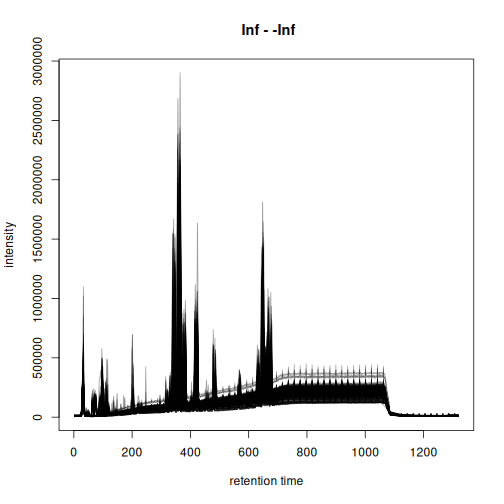

<!--
# Pre-render with (in the vignettes folder)
knitr::knit("large-scale-analysis.Rmd.orig", output = "large-scale-analysis.Rmd")
-->


**Note**: this vignette is
[**pre-computed**](https://ropensci.org/blog/2019/12/08/precompute-vignettes/).
See the session info for information on packages used and the date the vignette
was rendered. The vignette is completely reproducible and can be run and
evaluated locally. The full MS data is available in the MetaboLights
repository and is downloaded and cached as part of this vignette. Thus, to run
the code locally about 800GB of free disk space is required.

**Note**: the memory-saving functionality used in this document requires *xcms*
version >= 3.7.1 which is currently (April 2025) available in Bioconductor's
3.22 developmental branch. It can be installed from GitHub using
`remotes::install_github("sneumann/xcms")`.

**Information on computational setup**: this vignette was rendered on a Notebook
with an 13th Gen Intel(R) Core(TM) i7-1370P CPU and 64GB of main memory.


# Introduction

By design, *xcms* supports preprocessing of large scale data even with over
10,000 samples/data files. Handling the results of such experiments is however
non-trivial and can require a very large amount of main memory. Recent updates
to *xcms*, which include full support of the MS data infrastructure provided by
the *Spectra* package as well as a new *on-disk* storage mode for preprocessing
results, further reduce *xcms*' memory demand and hence enable memory-saving
large scale data processing also on regular computer setups. In this document a
large public metabolomics data set with about 4,000 data files is analyzed and
*xcms*' memory usage and performance tracked. Performance and memory usage for
different configurations are compared on a smaller data subset. Finally, details
on the internal data and memory handling of *xcms* are presented and properties
of different configurations for efficient (and parallel) processing of large
scale data are discussed.


# Data import

The data analyzed in this document was originally described in [this
paper](https://journals.plos.org/plosgenetics/article?id=10.1371/journal.pgen.1004801). The
full data is available in the MetaboLights repository with the accession ID
[MTBLS93](https://www.ebi.ac.uk/metabolights/editor/MTBLS93/descriptors).
Detailed description on the study cohort, LC-MS setup and the data acquisition
are provided in the original article's
[supplement](https://doi.org/10.1371/journal.pgen.1004801.s013). In brief,
samples were analyzed in Waters MSe mode, i.e., following an MS1 scan, an
all-ion fragmentation was performed and recorded as a MS2 scan. MS1 and MS2 data
are for each samples are stored in two separate MS data files in CDF format. MS1
data in files ending wiht *01.CDF* and the respective MS2 scans in a file with
same name, but ending in *02.CDF*. For the present analysis we focus on MS1 data
only and thus restrict the import to the MS1-only data files. The *MsIO* R
package and Bioconductor's *[MsBackendMetaboLights](https://bioconductor.org/packages/3.21/MsBackendMetaboLights)* packages are
used to retrieve and cache the MS data directly from the MetaboLights
repository.


``` r
#' Load required libraries
library(MsBackendMetaboLights)
library(MsExperiment)
library(MsIO)
library(xcms)

library(peakRAM) # Track memory usage and processing time
library(pander)  # To render tables

#' Retrieve the MS1 data from the MetaboLights data set
mlp <- MetaboLightsParam(mtblsId = "MTBLS93", filePattern = "01.CDF$")

twins <- readMsObject(MsExperiment(), mlp, keepOntology = FALSE,
                      keepProtocol = FALSE, simplify = FALSE)
twins
#> Object of class MsExperiment
#>  Spectra: MS1 (12082605)
#>  Experiment data: 4063 sample(s)
#>  Sample data links:
#>   - spectra: 4063 sample(s) to 12082605 element(s).
```

The data set includes in total 12082605 MS spectra for
4063 samples.

The size of the data object in memory:


``` r
print(object.size(twins), units = "GB")
#> 2.7 Gb
```

Note that this data object contains only the MS metadata (i.e., retention times,
MS levels etc), but no MS peaks data (i.e., *m/z* and intensity values). With
the default data representation of the *Spectra* package, MS peaks data are only
loaded upon demand from the original data files.


## Overview of sample and experiment metadata

Various experimental and sample metadata are available for the data set in the
imported object's `sampleData()`. These are directly imported from the
respective data files in *MetaboLights*. The format of the imported variable
names is however not ideal for R-based data processing and we thus rename the
most relevant ones below.


``` r
#' Select variable names with eventually interesting information
scol <- c("Factor Value[Gender]", "Factor Value[Age]",
          "Factor Value[Cluster effect]", "Factor Value[RMSD]",
          "Factor Value[Injection number]", "Factor Value[Spectrum type]",
          "Factor Value[Analysis date]", "Sample Name")
#' Define R-save names for these
names(scol) <- c("sex", "age", "cluster_effect", "rmsd", "injection_number",
                 "spectrum_type", "analysis_date", "sample_name")
#' Rename the variables
colnames(sampleData(twins))[match(scol, colnames(sampleData(twins)))] <-
    names(scol)

table(sampleData(twins)$sex)
#>
#> Female   Male
#>   1747   2316
```


## Parallel processing setup

Many functions from *xcms*, in particular the ones requiring heavy calculations,
support parallel processing. Processing functions will split the data among
these processes and perform the calculations in parallel. While parallel
processing can reduce the processing time, it is important to note that it also
requires all data that is being processed to be in memory. There should thus
always be a balance between the number of parallel processes and the
available/required memory needed. See also section *Performance evaluation*
below for more information. In our example we use 8 CPUs in parallel.


``` r
#' Default parallel processing setup.
register(MulticoreParam(8L))
```

Every function from *xcms* supporting parallel processing will now use this
default parallel processing setup.


## Initial data evaluation

Before preprocessing, we inspect the available LC-MS data and create a base peak
chromatogram (BPC). To reduce the processing time, we create this BPC on 200
randomly selected samples.


``` r
#' Select 200 randomly selected samples
set.seed(123)
twins_rand <- twins[sample(seq_along(twins), 200)]
```

We next create the BPC. With parameter `chunkSize = 8L` we specify to load and
process the MS peaks data of 8 MS data files at a time. The `peakRAM()` function
is used to track memory usage and processing time. While the function will
process the data of 8 files at a time in parallel, there is no large performance
gain for that, because the processing consists of simply returning the maximum
intensity per spectrum.


``` r
#' Create the BPC for the data subset
p <- peakRAM(
    bpc <- chromatogram(twins_rand, aggregationFun = "max", chunkSize = 8)
)
```

The time and maximal (peak) memory used are:


``` r
tmp <- data.frame(
    `Peak RAM [MiB]` = p$Peak_RAM_Used_MiB,
    `Processing time [min]` = p$Elapsed_Time_sec / 60,
    check.names = FALSE)
pandoc.table(
    tmp, style = "rmarkdown", split.table = Inf,
    caption = paste0("Peak RAM memory usage and processing time for ",
                     "BPC extraction from 200 random samples."))
```


| Peak RAM [MiB] | Processing time [min] |
|:--------------:|:---------------------:|
|      4848      |         4.877         |

Table: Peak RAM memory usage and processing time for BPC extraction from 200 random samples.

The BPC of these 200 random samples is shown below.


``` r
plot(bpc, col = "#00000060")
```



Based on the BPC above, we filter the data set to spectra measured between 20
and 900 seconds. Such restriction of the data set also avoids to perform the
chromatographic peak detection in the part of the LC where no compounds are
expected to elute. We strongly recommend such filtering before starting
preprocessing to reduce running time.


``` r
twins <- filterSpectra(twins, filterRt, rt = c(20, 900))
```

We next inspect the signal for selected lipids that have been annotated in the
original article (described in Figure S2 of the [original
paper](https://journals.plos.org/plosgenetics/article?id=10.1371/journal.pgen.1004801)).
The retention times and *m/z* values for these compounds were taken from the
original publication.


``` r
#' Define m/z and retention times for annotated lipids
kc <- data.frame(
    name = c("LysoPC_18:1", "LysoPC_18:2", "MG_18:2"),
    mz = c(522.356, 520.341, 337.269),
    rt = c(382.20, 347.28, 384.00)
)
rownames(kc) <- kc$name
kc$rtmin <- kc$rt - 20
kc$rtmax <- kc$rt + 20
kc$mzmin <- kc$mz - 0.01
kc$mzmax <- kc$mz + 0.01

pandoc.table(
    kc, split.table = Inf, style = "rmarkdown",
    caption = "Selected lipids that were annotated in the original article.")
```


|     &nbsp;      |    name     |  mz   |  rt   | rtmin | rtmax | mzmin | mzmax |
|:---------------:|:-----------:|:-----:|:-----:|:-----:|:-----:|:-----:|:-----:|
| **LysoPC_18:1** | LysoPC_18:1 | 522.4 | 382.2 | 362.2 | 402.2 | 522.3 | 522.4 |
| **LysoPC_18:2** | LysoPC_18:2 | 520.3 | 347.3 | 327.3 | 367.3 | 520.3 | 520.4 |
|   **MG_18:2**   |   MG_18:2   | 337.3 |  384  |  364  |  404  | 337.3 | 337.3 |

Table: Selected lipids that were annotated in the original article.

We extract and plot the ion chromatograms (EIC) for these 3 compounds from the
200 randomly selected samples.


``` r
#' Extract the ion chromatogram for the 3 compounds
eics <- chromatogram(twins_rand, mz = cbind(kc$mzmin, kc$mzmax),
                     rt = cbind(kc$rtmin, kc$rtmax), chunkSize = 8)
#' Plot the EICs
plot(eics, col = "#00000040")
```


Apparent retention time shifts are visible for all 3 compounds. We can next
evaluate chromatographic peak detection settings on these example signals.


``` r
param <- CentWaveParam(ppm = 25,
                       peakwidth = c(2, 20),
                       snthresh = 0,
                       mzCenterFun = "wMean",
                       integrate = 2)
met_test <- findChromPeaks(eics, param = param)
chromPeaks(met_test[1])
#>            mz   mzmin   mzmax      rt   rtmin   rtmax      into       intb
#> mzmin 522.356 522.346 522.366 383.178 375.894 388.319 2329316.3 1691671.50
#> mzmin 522.356 522.346 522.366 382.749 375.894 387.890 2109446.7 1535929.04
#> mzmin 522.356 522.346 522.366 382.318 375.034 387.031 2393436.5 1751258.46
#> mzmin 522.356 522.346 522.366 370.321 363.636 375.034  434015.4   74434.92
#> mzmin 522.356 522.346 522.366 382.747 376.321 388.317 2208231.7 1624551.74
#> mzmin 522.356 522.346 522.366 382.318 374.606 387.031 2392099.1 1752668.52
#> mzmin 522.356 522.346 522.366 370.321 364.494 374.606  430126.8   76103.65
#> mzmin 522.356 522.346 522.366 377.607 371.180 382.320 1214597.6  891277.16
#> mzmin 522.356 522.346 522.366 381.044 374.617 386.614 2051008.3 1510790.55
#> mzmin 522.356 522.346 522.366 369.904 364.505 374.617  352557.5   62286.20
#> mzmin 522.356 522.346 522.366 383.181 376.754 387.894 1531550.0 1129829.15
#> mzmin 522.356 522.346 522.366 377.607 371.180 382.748 1927843.5 1423372.16
#> mzmin 522.356 522.346 522.366 383.175 375.892 388.317 1629758.9 1184918.57
#> mzmin 522.356 522.346 522.366 383.612 377.185 389.440 1589031.2 1176171.86
#> mzmin 522.356 522.346 522.366 383.173 376.746 389.429 2576501.4 1899088.63
#> mzmin 522.356 522.346 522.366 366.214 362.358 371.614  425588.7   96881.15
#> mzmin 522.356 522.346 522.366 378.040 371.614 383.610 2195087.6 1621585.16
#> mzmin 522.356 522.346 522.366 382.754 375.899 388.324 2159818.3 1602575.03
#> mzmin 522.356 522.346 522.366 383.177 376.322 388.318 2948737.8 2170209.49
#> mzmin 522.356 522.346 522.366 381.464 374.609 386.605 3191880.9 2385121.53
#> mzmin 522.356 522.346 522.366 369.896 362.354 374.609  554584.3  104143.98
#> mzmin 522.356 522.346 522.366 375.889 369.462 380.602 2631447.2 1968139.48
#> mzmin 522.356 522.346 522.366 382.745 376.318 387.886 1732314.5 1264163.10
#> mzmin 522.356 522.346 522.366 383.173 376.317 388.314 2641640.3 1942733.78
#> mzmin 522.356 522.346 522.366 383.181 376.326 388.322 2707103.2 1991534.74
#> mzmin 522.356 522.346 522.366 383.607 376.752 388.323 1820800.0 1341464.66
#> mzmin 522.356 522.346 522.366 382.317 375.462 387.887 3086967.1 2267324.93
#> mzmin 522.356 522.346 522.366 383.173 376.318 388.314 1833619.3 1328743.13
#> mzmin 522.356 522.346 522.366 375.893 369.038 381.463 3575538.5 2586045.65
#> mzmin 522.356 522.346 522.366 382.316 375.032 387.885 2528997.2 1869255.11
#> mzmin 522.356 522.346 522.366 381.460 374.604 387.029 2386099.7 1765416.93
#> mzmin 522.356 522.346 522.366 369.891 363.635 374.604  434664.0   93316.89
#> mzmin 522.356 522.346 522.366 377.176 370.320 382.317 1372886.0 1020096.86
#> mzmin 522.356 522.346 522.366 382.744 375.889 387.457 3882497.9 2902222.68
#> mzmin 522.356 522.346 522.366 383.606 376.750 389.433 2290938.3 1701392.78
#> mzmin 522.356 522.346 522.366 381.467 375.041 387.037 2205818.0 1605043.83
#> mzmin 522.356 522.346 522.366 369.899 364.068 375.041  400725.1   69333.14
#> mzmin 522.356 522.346 522.366 382.322 375.466 387.463 2983000.5 2215309.75
#> mzmin 522.356 522.346 522.366 370.325 364.069 375.466  536203.8  100866.18
#> mzmin 522.356 522.346 522.366 381.470 374.614 387.039 1744270.9 1277046.70
#> mzmin 522.356 522.346 522.366 369.901 363.217 374.614  310520.7   62002.05
#> mzmin 522.356 522.346 522.366 381.887 375.461 387.457 2570326.9 1902625.93
#> mzmin 522.356 522.346 522.366 370.319 364.063 375.461  461963.8   90928.84
#> mzmin 522.356 522.346 522.366 365.787 362.359 370.329  336029.1   77130.24
#> mzmin 522.356 522.346 522.366 377.612 370.329 382.754 1753468.1 1295049.99
#> mzmin 522.356 522.346 522.366 381.462 375.035 386.603 1960124.3 1461845.40
#> mzmin 522.356 522.346 522.366 369.894 364.066 375.035  351685.1   65673.61
#> mzmin 522.356 522.346 522.366 384.030 378.032 389.429 2839861.5 2148561.46
#> mzmin 522.356 522.346 522.366 383.177 375.893 387.890 2022734.3 1424566.11
#> mzmin 522.356 522.346 522.366 381.464 374.609 387.034 2120881.8 1556217.28
#> mzmin 522.356 522.346 522.366 382.327 375.472 387.468 3059265.1 2290832.82
#> mzmin 522.356 522.346 522.366 376.750 369.894 381.463 1572198.4 1164669.17
#> mzmin 522.356 522.346 522.366 382.754 375.899 388.324 2175046.0 1601646.34
#> mzmin 522.356 522.346 522.366 384.037 377.610 389.436 2592548.2 1898588.63
#> mzmin 522.356 522.346 522.366 383.172 376.317 388.314 3459509.6 2586778.59
#> mzmin 522.356 522.346 522.366 378.032 371.177 383.173 4115139.5 3083989.90
#> mzmin 522.356 522.346 522.366 381.890 374.607 387.032 2435019.5 1780321.29
#> mzmin 522.356 522.346 522.366 369.894 364.065 374.607  438228.2   75817.86
#> mzmin 522.356 522.346 522.366 382.751 375.896 387.892 2108334.0 1528709.51
#> mzmin 522.356 522.346 522.366 365.785 362.357 371.184  257020.8   58746.50
#> mzmin 522.356 522.346 522.366 377.611 371.184 382.752 1279288.1  945989.96
#> mzmin 522.356 522.346 522.366 382.754 376.327 388.323 2860061.5 2110207.60
#> mzmin 522.356 522.346 522.366 383.174 376.747 388.316 1623732.7 1181611.49
#> mzmin 522.356 522.346 522.366 377.177 369.893 381.890 1450736.1 1070691.17
#> mzmin 522.356 522.346 522.366 376.747 369.892 381.888 2417939.6 1790279.09
#> mzmin 522.356 522.346 522.366 364.921 362.350 369.892  477242.6  108814.56
#> mzmin 522.356 522.346 522.366 382.327 375.469 387.468 2054364.1 1489768.27
#> mzmin 522.356 522.346 522.366 376.323 369.468 381.465 1896668.1 1341881.84
#> mzmin 522.356 522.346 522.366 374.614 367.501 380.183 2512580.9 1802720.55
#> mzmin 522.356 522.346 522.366 363.214 362.357 367.501  267706.8   31522.33
#> mzmin 522.356 522.346 522.366 374.186 367.929 380.184 2806922.9 2037468.41
#> mzmin 522.356 522.346 522.366 363.216 362.360 367.929  305205.5   44233.13
#> mzmin 522.356 522.346 522.366 383.610 376.326 389.437 1680233.2 1223924.74
#> mzmin 522.356 522.346 522.366 381.890 375.035 387.035 2839944.8 2124523.57
#> mzmin 522.356 522.346 522.366 369.893 363.209 375.035  498447.0   92836.46
#> mzmin 522.356 522.346 522.366 382.321 375.037 387.462 2387610.9 1770255.07
#> mzmin 522.356 522.346 522.366 370.753 364.497 375.037  418502.6   76885.77
#> mzmin 522.356 522.346 522.366 383.609 376.753 389.436 1707869.3 1240638.55
#> mzmin 522.356 522.346 522.366 382.748 375.893 387.890 2715833.1 2011645.71
#> mzmin 522.356 522.346 522.366 381.039 374.613 386.181 2383458.6 1789110.73
#> mzmin 522.356 522.346 522.366 369.471 362.355 374.613  405286.9   68922.42
#> mzmin 522.356 522.346 522.366 382.321 375.894 388.319 1553144.1 1137669.96
#> mzmin 522.356 522.346 522.366 381.463 373.750 386.175 1671733.5 1207688.53
#> mzmin 522.356 522.346 522.366 369.466 364.495 373.750  288513.7   47258.66
#> mzmin 522.356 522.346 522.366 381.889 375.463 387.888 3441607.2 2533879.00
#> mzmin 522.356 522.346 522.366 370.321 363.636 375.463  634226.3  126315.55
#> mzmin 522.356 522.346 522.366 383.177 376.322 388.318 2602114.3 1905624.44
#> mzmin 522.356 522.346 522.366 374.181 367.068 379.751 1849167.8 1327442.63
#> mzmin 522.356 522.346 522.366 362.784 362.355 367.068  181227.7   24808.36
#> mzmin 522.356 522.346 522.366 377.611 371.185 382.753 1836921.1 1339196.74
#> mzmin 522.356 522.346 522.366 381.033 374.178 386.174 2273686.2 1685856.81
#> mzmin 522.356 522.346 522.366 369.465 362.351 374.178  386210.5   58625.22
#> mzmin 522.356 522.346 522.366 382.750 375.037 387.462 1941136.0 1407841.42
#> mzmin 522.356 522.346 522.366 382.317 375.462 387.887 2908273.1 2171393.49
#> mzmin 522.356 522.346 522.366 370.749 364.492 375.462  525866.9  107235.46
#> mzmin 522.356 522.346 522.366 382.324 375.897 388.323 1930101.1 1433470.24
#> mzmin 522.356 522.346 522.366 381.888 375.033 387.029 2104067.1 1579663.86
#> mzmin 522.356 522.346 522.366 369.891 364.064 375.033  374093.3   82309.65
#> mzmin 522.356 522.346 522.366 384.030 377.603 390.286 2816404.0 2105579.31
#> mzmin 522.356 522.346 522.366 383.173 376.318 387.886 1860123.3 1353316.23
#> mzmin 522.356 522.346 522.366 382.752 375.897 387.894 2060690.8 1524632.98
#> mzmin 522.356 522.346 522.366 377.183 370.328 382.753 2398310.6 1776359.45
#> mzmin 522.356 522.346 522.366 384.033 377.178 389.433 2016474.3 1503485.86
#> mzmin 522.356 522.346 522.366 376.747 369.892 381.888 1547326.5 1146186.03
#> mzmin 522.356 522.346 522.366 377.175 370.320 383.603 3267830.4 2455793.13
#> mzmin 522.356 522.346 522.366 382.743 375.887 388.313 2594247.4 1873505.46
#> mzmin 522.356 522.346 522.366 383.601 377.174 389.429 2290447.0 1698780.21
#> mzmin 522.356 522.346 522.366 384.035 377.180 389.436 2188753.8 1616893.48
#> mzmin 522.356 522.346 522.366 383.603 376.747 388.316 2460009.9 1810715.92
#> mzmin 522.356 522.346 522.366 374.179 367.495 379.749 3427851.9 2473450.62
#> mzmin 522.356 522.346 522.366 362.782 362.353 367.495  372087.4   56528.76
#> mzmin 522.356 522.346 522.366 378.462 372.036 383.175 1732354.5 1291130.12
#> mzmin 522.356 522.346 522.366 366.636 362.352 372.036  321711.8   65439.54
#> mzmin 522.356 522.346 522.366 381.888 375.461 387.457 2398272.9 1782877.22
#> mzmin 522.356 522.346 522.366 370.319 364.063 375.461  430338.6   87766.60
#> mzmin 522.356 522.346 522.366 383.181 375.897 388.322 1603270.6 1175248.15
#> mzmin 522.356 522.346 522.366 376.320 369.465 381.461 1869104.7 1372367.90
#> mzmin 522.356 522.346 522.366 382.328 375.044 387.469 3082433.4 2268962.12
#> mzmin 522.356 522.346 522.366 374.604 367.920 394.144 4831351.8 3201555.22
#> mzmin 522.356 522.346 522.366 363.207 362.350 367.920  518646.0   67333.93
#> mzmin 522.356 522.346 522.366 381.034 374.179 386.176 3515374.7 2613813.20
#> mzmin 522.356 522.346 522.366 369.466 363.210 374.179  618747.6  112703.34
#> mzmin 522.356 522.346 522.366 382.747 375.892 387.888 3926847.7 2911104.77
#> mzmin 522.356 522.346 522.366 382.319 375.892 387.461 2903971.2 2149496.31
#> mzmin 522.356 522.346 522.366 381.462 374.178 386.603 2455397.1 1777168.53
#> mzmin 522.356 522.346 522.366 381.036 374.180 386.177 3655263.1 2735203.41
#> mzmin 522.356 522.346 522.366 369.467 362.783 374.180  600349.1   89983.64
#> mzmin 522.356 522.346 522.366 381.031 374.176 386.173 2734818.9 2068683.65
#> mzmin 522.356 522.346 522.366 369.463 363.207 374.176  464874.5   87599.05
#> mzmin 522.356 522.346 522.366 381.474 375.476 387.472 2500566.2 1870099.34
#> mzmin 522.356 522.346 522.366 369.906 364.506 375.476  454479.8   95211.65
#> mzmin 522.356 522.346 522.366 383.178 375.894 387.891  975931.6  709929.88
#> mzmin 522.356 522.346 522.366 383.608 377.182 390.722 2575421.6 1917031.01
#> mzmin 522.356 522.346 522.366 383.612 376.757 389.440 2023281.7 1480673.18
#> mzmin 522.356 522.346 522.366 377.608 371.610 382.321 1768729.0 1311186.28
#> mzmin 522.356 522.346 522.366 383.185 377.187 389.441 2221410.8 1660751.00
#> mzmin 522.356 522.346 522.366 377.615 370.331 382.328 1596238.2 1164622.07
#> mzmin 522.356 522.346 522.366 382.755 375.900 387.897 2174740.6 1571647.17
#> mzmin 522.356 522.346 522.366 383.601 376.318 388.314 3141739.6 2290738.90
#> mzmin 522.356 522.346 522.366 366.215 362.359 370.758  342072.9   75665.96
#> mzmin 522.356 522.346 522.366 377.613 370.758 383.183 1801191.5 1338311.43
#> mzmin 522.356 522.346 522.366 383.173 375.890 387.886 1952504.9 1414881.83
#> mzmin 522.356 522.346 522.366 381.891 375.464 387.032 2689176.8 2019966.43
#> mzmin 522.356 522.346 522.366 369.894 363.638 375.464  491346.9  107065.33
#> mzmin 522.356 522.346 522.366 374.605 367.492 379.746 2820994.7 2039365.32
#> mzmin 522.356 522.346 522.366 363.207 362.350 367.492  325471.8   49337.28
#> mzmin 522.356 522.346 522.366 377.183 370.327 381.896 2491687.0 1827564.73
#> mzmin 522.356 522.346 522.366 382.747 375.892 387.891 2030175.9 1488602.17
#> mzmin 522.356 522.346 522.366 381.893 375.035 387.034 3042707.7 2186548.50
#> mzmin 522.356 522.346 522.366 382.754 376.327 387.895 2317259.0 1712817.01
#> mzmin 522.356 522.346 522.366 366.216 362.360 371.615  407195.8   88697.78
#> mzmin 522.356 522.346 522.366 378.042 371.615 383.183 2115309.4 1574874.53
#> mzmin 522.356 522.346 522.366 384.041 376.757 389.440 1698767.8 1225010.04
#> mzmin 522.356 522.346 522.366 382.755 375.900 388.325 2381527.4 1774809.40
#> mzmin 522.356 522.346 522.366 382.756 375.900 387.897 2646746.7 1949922.67
#> mzmin 522.356 522.346 522.366 381.893 375.037 387.034 1716654.1 1267824.37
#> mzmin 522.356 522.346 522.366 369.896 363.638 375.037  302022.7   56762.70
#> mzmin 522.356 522.346 522.366 382.322 375.467 387.892 3003463.9 2171491.76
#> mzmin 522.356 522.346 522.366 373.748 367.492 379.318 4314066.9 3216038.15
#> mzmin 522.356 522.346 522.366 362.779 362.350 367.492  462992.4   88084.72
#> mzmin 522.356 522.346 522.366 381.891 374.608 386.604 2589521.9 1884998.67
#> mzmin 522.356 522.346 522.366 375.034 367.921 380.175 3795309.3 2731289.55
#> mzmin 522.356 522.346 522.366 377.606 370.750 382.747 1593461.9 1182094.34
#> mzmin 522.356 522.346 522.366 381.035 373.751 387.462 2679117.9 1929073.93
#> mzmin 522.356 522.346 522.366 369.467 362.354 373.751  460677.3   69319.93
#> mzmin 522.356 522.346 522.366 382.750 375.895 388.320 2211528.4 1614088.25
#> mzmin 522.356 522.346 522.366 383.179 376.753 389.436 2728839.6 2033429.50
#> mzmin 522.356 522.346 522.366 382.747 376.749 388.317 4462456.3 3359281.38
#> mzmin 522.356 522.346 522.366 375.891 369.036 380.175 2765294.8 2051628.31
#> mzmin 522.356 522.346 522.366 384.893 378.466 389.864 1850762.9 1357849.61
#> mzmin 522.356 522.346 522.366 376.746 370.319 381.887 1838111.4 1384937.19
#> mzmin 522.356 522.346 522.366 364.920 362.349 370.319  348657.3   79093.96
#> mzmin 522.356 522.346 522.366 377.187 370.331 382.328 1919850.2 1414417.19
#> mzmin 522.356 522.346 522.366 382.319 375.463 387.460 2512170.8 1825938.48
#> mzmin 522.356 522.346 522.366 383.176 375.893 388.318 3464110.3 2548938.97
#> mzmin 522.356 522.346 522.366 382.325 375.041 387.895 1711929.3 1236520.51
#> mzmin 522.356 522.346 522.366 382.750 375.466 387.463 1874994.7 1356212.89
#> mzmin 522.356 522.346 522.366 384.031 378.032 389.430 2335830.3 1750741.50
#> mzmin 522.356 522.346 522.366 382.326 375.043 387.468 1856984.8 1353801.10
#> mzmin 522.356 522.346 522.366 382.750 375.466 387.891 2374613.8 1731508.24
#> mzmin 522.356 522.346 522.366 382.755 376.329 387.897 1224086.2  912666.04
#> mzmin 522.356 522.346 522.366 370.759 365.785 376.329  234859.9   48467.91
#> mzmin 522.356 522.346 522.366 375.471 367.930 380.613 2815492.0 2039228.18
#> mzmin 522.356 522.346 522.366 383.177 375.894 387.890 3520511.7 2543703.97
#> mzmin 522.356 522.346 522.366 384.040 377.185 389.868 2177350.0 1587466.74
#> mzmin 522.356 522.346 522.366 366.207 362.351 371.606  433835.4  108867.86
#> mzmin 522.356 522.346 522.366 377.604 371.606 382.746 2115917.6 1586722.51
#> mzmin 522.356 522.346 522.366 382.319 375.035 387.032 1836587.3 1332930.29
#> mzmin 522.356 522.346 522.366 370.751 364.495 375.035  345512.1   60528.73
#> mzmin 522.356 522.346 522.366 374.608 367.923 379.749 3913180.9 2967303.64
#> mzmin 522.356 522.346 522.366 363.210 362.353 367.923  441399.8  101855.91
#> mzmin 522.356 522.346 522.366 377.181 370.326 381.894 1647764.0 1230961.34
#> mzmin 522.356 522.346 522.366 383.172 375.460 387.885 3167492.8 2323885.71
#> mzmin 522.356 522.346 522.366 383.175 376.748 387.888 2019163.5 1477971.10
#> mzmin 522.356 522.346 522.366 374.607 367.923 387.032 2550426.6 1808383.23
#> mzmin 522.356 522.346 522.366 363.210 362.353 367.923  307543.1   71084.43
#> mzmin 522.356 522.346 522.366 377.605 370.321 382.318 1556959.9 1109312.71
#> mzmin 522.356 522.346 522.366 383.605 376.749 389.432 2800439.6 2068253.05
#> mzmin 522.356 522.346 522.366 383.182 375.899 388.327 2135799.0 1549305.38
#> mzmin 522.356 522.346 522.366 382.321 375.466 387.891 2858350.2 2122520.26
#> mzmin 522.356 522.346 522.366 370.325 364.068 375.466  533950.6  119288.08
#> mzmin 522.356 522.346 522.366 382.320 375.893 387.890 2309688.4 1722115.28
#> mzmin 522.356 522.346 522.366 370.752 364.924 375.893  434450.1   88519.09
#> mzmin 522.356 522.346 522.366 381.040 374.184 386.181 3162709.2 2365360.58
#> mzmin 522.356 522.346 522.366 369.900 363.644 374.184  538486.3   94416.87
#> mzmin 522.356 522.346 522.366 381.891 374.608 386.604 1919625.7 1413361.24
#> mzmin 522.356 522.346 522.366 369.895 363.210 374.608  338807.8   64929.27
#> mzmin 522.356 522.346 522.366 384.031 376.747 389.430 3574349.2 2619786.77
#> mzmin 522.356 522.346 522.366 381.035 374.180 386.605 2846110.7 2107483.17
#> mzmin 522.356 522.346 522.366 369.467 364.068 374.180  503873.6   94600.22
#> mzmin 522.356 522.346 522.366 382.747 375.892 388.317 1914724.6 1369926.79
#> mzmin 522.356 522.346 522.366 383.175 376.320 388.316 3006959.5 2220269.66
#> mzmin 522.356 522.346 522.366 378.889 371.606 384.031 1921871.0 1407428.48
#> mzmin 522.356 522.346 522.366 366.635 362.350 371.606  349116.9   72229.71
#> mzmin 522.356 522.346 522.366 383.174 376.747 389.433 3403531.9 2527401.86
#> mzmin 522.356 522.346 522.366 383.171 376.744 389.427 2312758.2 1705158.93
#> mzmin 522.356 522.346 522.366 383.172 376.317 388.314 1932861.1 1371756.67
#> mzmin 522.356 522.346 522.366 382.749 376.322 388.319 2648367.9 1961782.47
#> mzmin 522.356 522.346 522.366 375.466 369.039 381.036 3384097.4 2491074.90
#> mzmin 522.356 522.346 522.366 365.351 362.352 370.322  244400.6   56296.32
#> mzmin 522.356 522.346 522.366 377.177 370.322 382.747 1243229.5  919984.16
#> mzmin 522.356 522.346 522.366 375.044 367.931 379.757 3401917.5 2532918.45
#> mzmin 522.356 522.346 522.366 363.218 362.361 367.931  440918.5   93091.05
#> mzmin 522.356 522.346 522.366 384.459 378.032 390.287 2550648.3 1908433.56
#> mzmin 522.356 522.346 522.366 376.318 369.891 381.888 3853586.8 2846487.26
#> mzmin 522.356 522.346 522.366 381.032 374.177 385.745 2821263.8 2085828.83
#> mzmin 522.356 522.346 522.366 369.464 363.208 374.177  482147.5   70749.46
#> mzmin 522.356 522.346 522.366 383.178 376.751 389.434 2897790.2 2154484.07
#> mzmin 522.356 522.346 522.366 381.462 374.606 386.603 1647892.9 1226547.13
#> mzmin 522.356 522.346 522.366 369.893 365.351 374.606  278696.2   46999.41
#> mzmin 522.356 522.346 522.366 381.036 373.752 386.177 2020923.5 1462086.20
#> mzmin 522.356 522.346 522.366 369.468 362.355 373.752  340468.3   47034.35
#> mzmin 522.356 522.346 522.366 383.179 376.324 388.320 1577779.1 1139311.95
#> mzmin 522.356 522.346 522.366 383.178 376.751 388.319 3359094.6 2486753.17
#> mzmin 522.356 522.346 522.366 383.175 376.748 388.316 1841937.5 1354622.15
#> mzmin 522.356 522.346 522.366 382.745 376.746 388.314 1166437.2  837247.79
#> mzmin 522.356 522.346 522.366 381.890 375.034 387.459 2743686.0 2046556.01
#> mzmin 522.356 522.346 522.366 370.322 364.065 375.034  481238.6   92630.72
#> mzmin 522.356 522.346 522.366 383.602 376.747 389.429 3428582.1 2588084.81
#> mzmin 522.356 522.346 522.366 371.604 365.776 376.747  646964.6  147756.72
#> mzmin 522.356 522.346 522.366 382.323 375.468 387.465 1145822.5  838750.87
#> mzmin 522.356 522.346 522.366 370.755 364.927 375.468  214481.2   39355.57
#> mzmin 522.356 522.346 522.366 381.036 373.752 385.751 1445241.5 1048126.32
#> mzmin 522.356 522.346 522.366 369.467 362.354 373.752  244374.5   32865.30
#> mzmin 522.356 522.346 522.366 382.751 375.896 387.896 1589300.4 1130817.52
#> mzmin 522.356 522.346 522.366 364.923 362.352 370.322  624172.7  175046.58
#> mzmin 522.356 522.346 522.366 376.749 370.322 382.747 2966208.1 2234019.11
#> mzmin 522.356 522.346 522.366 374.183 367.927 379.753 3288162.9 2508525.88
#> mzmin 522.356 522.346 522.366 363.214 362.357 367.927  363254.6   85045.73
#> mzmin 522.356 522.346 522.366 381.474 374.619 386.616 2327763.7 1693686.86
#> mzmin 522.356 522.346 522.366 369.906 362.793 374.619  412984.1   72401.54
#> mzmin 522.356 522.346 522.366 374.604 367.920 381.459 2613982.1 1896292.25
#> mzmin 522.356 522.346 522.366 363.207 362.350 367.920  297866.1   54577.98
#> mzmin 522.356 522.346 522.366 382.321 375.466 387.891 3033563.0 2222154.91
#> mzmin 522.356 522.346 522.366 380.606 373.323 385.748 2129342.8 1578041.91
#> mzmin 522.356 522.346 522.366 369.467 362.354 373.323  375599.6   60424.71
#> mzmin 522.356 522.346 522.366 382.746 375.462 387.887 1978066.9 1434326.17
#> mzmin 522.356 522.346 522.366 374.609 367.924 381.039 3001146.6 2197610.82
#> mzmin 522.356 522.346 522.366 363.211 362.354 367.924  349321.1   65234.48
#> mzmin 522.356 522.346 522.366 381.901 374.617 386.617 1959836.4 1441143.39
#> mzmin 522.356 522.346 522.366 369.904 364.076 374.617  361967.8   73823.90
#> mzmin 522.356 522.346 522.366 382.749 375.466 387.891 1931735.0 1421249.78
#> mzmin 522.356 522.346 522.366 375.033 367.920 381.032 1568617.2 1113491.16
#> mzmin 522.356 522.346 522.366 363.207 362.350 367.920  195614.8   34299.58
#> mzmin 522.356 522.346 522.366 381.893 375.037 387.462 2206663.4 1618709.06
#> mzmin 522.356 522.346 522.366 370.324 362.783 375.037  400282.3   73240.71
#> mzmin 522.356 522.346 522.366 382.754 376.756 387.896 2397374.5 1777954.32
#> mzmin 522.356 522.346 522.366 374.176 367.492 379.746 2819379.4 2046839.32
#> mzmin 522.356 522.346 522.366 362.779 362.350 367.492  304216.8   48229.23
#> mzmin 522.356 522.346 522.366 383.176 376.318 388.317 2574295.2 1863297.21
#> mzmin 522.356 522.346 522.366 365.784 362.357 369.898  250445.9   55641.36
#> mzmin 522.356 522.346 522.366 377.610 369.898 382.323 1262619.8  918800.48
#> mzmin 522.356 522.346 522.366 377.611 370.756 382.753 1538661.9 1141035.50
#>            maxo sn row column
#> mzmin 505062.25  5   1      1
#> mzmin 469037.25  5   1      2
#> mzmin 527234.00  5   1      3
#> mzmin  99709.62  0   1      3
#> mzmin 476111.50  5   1      4
#> mzmin 544067.50  5   1      5
#> mzmin  99405.19  0   1      5
#> mzmin 274477.00  5   1      6
#> mzmin 460259.50  5   1      7
#> mzmin  86726.44  0   1      7
#> mzmin 341555.25  5   1      8
#> mzmin 422490.25  5   1      9
#> mzmin 358786.75  5   1     10
#> mzmin 337271.50  5   1     11
#> mzmin 530651.00  5   1     12
#> mzmin  97933.19  0   1     13
#> mzmin 495421.50  5   1     13
#> mzmin 482105.50  5   1     14
#> mzmin 654380.00  5   1     15
#> mzmin 696622.00  5   1     16
#> mzmin 133485.38  0   1     16
#> mzmin 580158.50  5   1     17
#> mzmin 386764.50  5   1     18
#> mzmin 567964.00  5   1     19
#> mzmin 599651.50  5   1     20
#> mzmin 396753.25  5   1     21
#> mzmin 670585.00  5   1     22
#> mzmin 412412.75  5   1     23
#> mzmin 783054.50  5   1     24
#> mzmin 560243.00  5   1     25
#> mzmin 535759.50  5   1     26
#> mzmin 105577.31  0   1     26
#> mzmin 310655.00  5   1     27
#> mzmin 871173.50  5   1     28
#> mzmin 485717.75  5   1     29
#> mzmin 484035.50  5   1     30
#> mzmin  94391.25  0   1     30
#> mzmin 659508.50  5   1     31
#> mzmin 127623.81  0   1     31
#> mzmin 378348.25  5   1     32
#> mzmin  76249.00  0   1     32
#> mzmin 588307.50  5   1     33
#> mzmin 111054.12  0   1     33
#> mzmin  80581.44  0   1     34
#> mzmin 398369.00  5   1     34
#> mzmin 429353.25  5   1     35
#> mzmin  85248.75  0   1     35
#> mzmin 613045.00  5   1     36
#> mzmin 433912.25  5   1     37
#> mzmin 443480.00  5   1     38
#> mzmin 688977.50  5   1     39
#> mzmin 347689.25  5   1     40
#> mzmin 469665.50  5   1     41
#> mzmin 560474.00  5   1     42
#> mzmin 769049.00  5   1     43
#> mzmin 909657.00  5   1     44
#> mzmin 522593.00  5   1     45
#> mzmin 100564.25  0   1     45
#> mzmin 450016.75  5   1     46
#> mzmin  58704.38  0   1     47
#> mzmin 282637.75  5   1     47
#> mzmin 648903.00  5   1     48
#> mzmin 349884.75  5   1     49
#> mzmin 324932.25  5   1     50
#> mzmin 550390.50  5   1     51
#> mzmin 110184.38  0   1     51
#> mzmin 453999.75  5   1     52
#> mzmin 394729.00  5   1     53
#> mzmin 467216.75  4   1     54
#> mzmin  80938.94  0   1     54
#> mzmin 505360.50  4   1     55
#> mzmin  97738.19  0   1     55
#> mzmin 354359.25  5   1     56
#> mzmin 618766.50  5   1     57
#> mzmin 115579.00  0   1     57
#> mzmin 535672.00  5   1     58
#> mzmin  97729.69  0   1     58
#> mzmin 345654.75  5   1     59
#> mzmin 617972.00  5   1     60
#> mzmin 528756.50  5   1     61
#> mzmin  99231.75  0   1     61
#> mzmin 346038.25  5   1     62
#> mzmin 377532.75  5   1     63
#> mzmin  71880.00  0   1     63
#> mzmin 749257.50  5   1     64
#> mzmin 148101.75  0   1     64
#> mzmin 563324.50  5   1     65
#> mzmin 338636.25  4   1     66
#> mzmin  64183.00  0   1     66
#> mzmin 415433.75  5   1     67
#> mzmin 493507.75  5   1     68
#> mzmin  91182.31  0   1     68
#> mzmin 432411.75  5   1     69
#> mzmin 652434.00  5   1     70
#> mzmin 120804.25  0   1     70
#> mzmin 416632.00  5   1     71
#> mzmin 468365.75  5   1     72
#> mzmin  90546.19  0   1     72
#> mzmin 596241.50  4   1     73
#> mzmin 410788.25  5   1     74
#> mzmin 459830.75  5   1     75
#> mzmin 540872.50  5   1     76
#> mzmin 429923.75  5   1     77
#> mzmin 337735.75  5   1     78
#> mzmin 725348.50  5   1     79
#> mzmin 542000.00  5   1     80
#> mzmin 468235.75  5   1     81
#> mzmin 468371.00  5   1     82
#> mzmin 552889.50  5   1     83
#> mzmin 636915.50  4   1     84
#> mzmin 123911.31  0   1     84
#> mzmin 390472.50  5   1     85
#> mzmin  75670.31  0   1     85
#> mzmin 534114.50  5   1     86
#> mzmin 102293.38  0   1     86
#> mzmin 349704.50  5   1     87
#> mzmin 411993.75  5   1     88
#> mzmin 684744.50  5   1     89
#> mzmin 784298.00  4   1     90
#> mzmin 146382.75  0   1     90
#> mzmin 801146.50  5   1     91
#> mzmin 155463.50  0   1     91
#> mzmin 880783.50  5   1     92
#> mzmin 631979.00  5   1     93
#> mzmin 526810.00  5   1     94
#> mzmin 797662.00  5   1     95
#> mzmin 150555.62  0   1     95
#> mzmin 627422.50  5   1     96
#> mzmin 118060.19  0   1     96
#> mzmin 535503.00  5   1     97
#> mzmin 108710.06  0   1     97
#> mzmin 214049.50  5   1     98
#> mzmin 546659.00  5   1     99
#> mzmin 418177.25  4   1    100
#> mzmin 395658.00  5   1    101
#> mzmin 476857.25  5   1    102
#> mzmin 349556.75  5   1    103
#> mzmin 463396.75  5   1    104
#> mzmin 689120.50  5   1    105
#> mzmin  79409.56  0   1    106
#> mzmin 409021.00  5   1    106
#> mzmin 431215.25  5   1    107
#> mzmin 595986.00  5   1    108
#> mzmin 115880.94  0   1    108
#> mzmin 525786.00  4   1    109
#> mzmin 100198.44  0   1    109
#> mzmin 542828.00  5   1    110
#> mzmin 435780.00  5   1    111
#> mzmin 654031.50  5   1    112
#> mzmin 507430.50  5   1    113
#> mzmin  93856.75  0   1    114
#> mzmin 472216.50  5   1    114
#> mzmin 357488.25  5   1    115
#> mzmin 522813.25  5   1    116
#> mzmin 584634.00  5   1    117
#> mzmin 380565.00  5   1    118
#> mzmin  72141.19  0   1    118
#> mzmin 646349.00  5   1    119
#> mzmin 876852.00  5   1    120
#> mzmin 158602.38  0   1    120
#> mzmin 570932.50  5   1    121
#> mzmin 770536.00  5   1    122
#> mzmin 351706.25  5   1    123
#> mzmin 545440.50  5   1    124
#> mzmin 111217.25  0   1    124
#> mzmin 470147.75  5   1    125
#> mzmin 577577.50  5   1    126
#> mzmin 982702.50  5   1    127
#> mzmin 618394.50  5   1    128
#> mzmin 393125.00  5   1    129
#> mzmin 418638.25  5   1    130
#> mzmin  84117.31  0   1    130
#> mzmin 436238.00  5   1    131
#> mzmin 539739.00  5   1    132
#> mzmin 751589.50  5   1    133
#> mzmin 369992.25  5   1    134
#> mzmin 408669.75  5   1    135
#> mzmin 489026.75  5   1    136
#> mzmin 413686.00  5   1    137
#> mzmin 525865.00  5   1    138
#> mzmin 278108.50  5   1    139
#> mzmin  53870.31  0   1    139
#> mzmin 574771.00  5   1    140
#> mzmin 784325.50  5   1    141
#> mzmin 462810.50  5   1    142
#> mzmin 101750.38  1   1    143
#> mzmin 480395.25  5   1    143
#> mzmin 408442.75  5   1    144
#> mzmin  82881.75  0   1    144
#> mzmin 800261.50  5   1    145
#> mzmin 148591.75  0   1    145
#> mzmin 387537.25  5   1    146
#> mzmin 696948.00  5   1    147
#> mzmin 453467.25  5   1    148
#> mzmin 500884.00  5   1    149
#> mzmin  91079.81  0   1    149
#> mzmin 334148.25  5   1    150
#> mzmin 583614.00  5   1    151
#> mzmin 475058.50  5   1    152
#> mzmin 626606.00  5   1    153
#> mzmin 129955.50  0   1    153
#> mzmin 516856.50  5   1    154
#> mzmin 101405.25  0   1    154
#> mzmin 710441.50  5   1    155
#> mzmin 134606.62  0   1    155
#> mzmin 434388.50  5   1    156
#> mzmin  84035.31  0   1    156
#> mzmin 745037.00  5   1    157
#> mzmin 623132.00  5   1    158
#> mzmin 129783.62  0   1    158
#> mzmin 408664.25  5   1    159
#> mzmin 667948.50  5   1    160
#> mzmin 421596.00  5   1    161
#> mzmin  82891.94  0   1    161
#> mzmin 699641.50  5   1    162
#> mzmin 478371.75  5   1    163
#> mzmin 404516.75  4   1    164
#> mzmin 592300.50  5   1    165
#> mzmin 723406.00  5   1    166
#> mzmin  58321.78  1   1    167
#> mzmin 281265.50  5   1    167
#> mzmin 705038.00  5   1    168
#> mzmin 132605.12  0   1    168
#> mzmin 542212.00  5   1    169
#> mzmin 831527.50  5   1    170
#> mzmin 637830.50  5   1    171
#> mzmin 118921.50  0   1    171
#> mzmin 589878.50  5   1    172
#> mzmin 359412.25  5   1    173
#> mzmin  66032.00  0   1    173
#> mzmin 438044.25  5   1    174
#> mzmin  81963.75  0   1    174
#> mzmin 340489.75  4   1    175
#> mzmin 764716.00  5   1    176
#> mzmin 413497.00  5   1    177
#> mzmin 252840.25  5   1    178
#> mzmin 608550.00  5   1    179
#> mzmin 113447.69  0   1    179
#> mzmin 742607.00  5   1    180
#> mzmin 146555.12  0   1    180
#> mzmin 256186.12  5   1    181
#> mzmin  51481.81  0   1    181
#> mzmin 315986.25  5   1    182
#> mzmin  62163.91  0   1    182
#> mzmin 347370.50  5   1    183
#> mzmin 142201.88  1   1    184
#> mzmin 641799.00  5   1    184
#> mzmin 705950.50  5   1    185
#> mzmin 126246.38  0   1    185
#> mzmin 503605.75  5   1    186
#> mzmin 102277.75  0   1    186
#> mzmin 483006.25  4   1    187
#> mzmin  92715.88  0   1    187
#> mzmin 657469.50  5   1    188
#> mzmin 458763.25  5   1    189
#> mzmin  91418.88  0   1    189
#> mzmin 433193.75  5   1    190
#> mzmin 560260.00  4   1    191
#> mzmin 106375.75  0   1    191
#> mzmin 436491.50  5   1    192
#> mzmin  87910.88  0   1    192
#> mzmin 439303.50  5   1    193
#> mzmin 284208.00  4   1    194
#> mzmin  56540.03  0   1    194
#> mzmin 468735.50  5   1    195
#> mzmin  91264.31  0   1    195
#> mzmin 528609.00  5   1    196
#> mzmin 525601.00  4   1    197
#> mzmin 100532.81  0   1    197
#> mzmin 574200.50  5   1    198
#> mzmin  58813.25  0   1    199
#> mzmin 284014.00  5   1    199
#> mzmin 351122.25  5   1    200
plot(met_test)
```


Chromatographic peaks were detected in all cases, but due to the large number of
samples investigated it is not easy to evaluate the results properly. We thus
create the same plot for only the first 5 samples.


``` r
plot(met_test[, 1:5])
```


The large peak was thus correctly identified. Also the lower abundance peak
would be detected if the `snthresh` would be reduced for the peak detection in
the EIC signal. Noise estimation is difficult for peak detection in extracted
ion signals, as most of the chromatogram contains actual signal from the
ion. This is different for the preprocessing on the full data set performed in
the next section as much more *real* background signal is present in the full MS
data to properly estimate the noise.


## Preprocessing

We next perform the preprocessing of the LC-MS data. Settings of the individual
processing steps were taken from the original [data analysis R
script](https://github.com/andgan/metabolomics_pipeline) and adapted to the new
*xcms* interface.

At first we perform the chromatographic peak detection using the *centWave*
method. With the parameter `hdf5File` we define the name (and eventually path)
for a file to keep the preprocessing results. Information on identified
chromatographic peaks and results from later preprocessing steps will then be
stored into this file. The HDF5 file format guarantees efficient storage, and
retrieval, of these results or subsets thereof. The memory footprint of this new
result object is thus very small which is ideal for the processing of very large
data sets, also on conventional computing infrastructure (e.g. laptop). With
`chunkSize = 8` we define to load and process the MS data of 8 data files at a
time. Peak detection is then performed in parallel on 8 CPUs using our
predefined default parallel processing setup.


``` r
cwp <- CentWaveParam(ppm = 25,
                     peakwidth = c(2, 20),
                     prefilter = c(3, 500),
                     snthresh = 8,
                     mzCenterFun = "wMean",
                     integrate = 2)

if (file.exists("twins.h5")) invisible(file.remove("twins.h5"))
p <- peakRAM(
    twins <- findChromPeaks(twins, param = cwp, chunkSize = 8,
                            hdf5File = "twins.h5")
)
```

Memory usage and time elapsed for this processing step where:


``` r
tmp <- data.frame(
    `Peak RAM [MiB]` = p$Peak_RAM_Used_MiB,
    `Processing time [min]` = p$Elapsed_Time_sec / 60,
    check.names = FALSE)
pandoc.table(
    tmp, style = "rmarkdown", split.table = Inf,
    caption = paste0("Peak RAM memory usage and processing time for ",
                     "the chromatographic peak detection step on the",
                     " full data."))
```


| Peak RAM [MiB] | Processing time [min] |
|:--------------:|:---------------------:|
|      8618      |         422.1         |

Table: Peak RAM memory usage and processing time for the chromatographic peak detection step on the full data.

As a result, the `findChromPeaks()` function returned an object of type
`XcmsExperimentHdf5`, which, as described above, stored all preprocessing
results on-disk in a file in HDF5 format. The size of this result object in
memory is thus not much larger than the original object representing the MS
data:


``` r
print(object.size(twins), units = "GB")
#> 1.8 Gb
```

The identified chromatographic peaks are stored as a numeric matrix. Depending
on the size of the experiment and MS data files as well as the used peak
detection settings, this matrix can also be very large and use a big part of the
main memory, which can significantly slow down subsequent analysis steps. Below
we load this data matrix into memory to evaluate its size.


``` r
#' Load the chromatographic peak detection results and
#' get its size.
chromPeaks(twins) |>
    object.size() |>
    print(units = "GB")
#> 3.4 Gb
```

For the present data set and the used settings, the size of the chromatographic
peak matrix seems manageable also for regular computers. However, having this
data object all the time in memory can have negative impact on processing
efficiency and in the worst case have R running out of memory along the
further analysis.

Below we count the number of chromatographic peaks detected per sample and
determine also their total sum. Here we take advantage of the possibility to
load only selected columns of the chromatographic peak matrix, which will reduce
the memory need for the present calculation. Also, we use `bySample = TRUE`
which returns the result as a `list` of chromatographic peak matrices. The
length of the list is equal to the number of samples and each element is the
chromatographic peak matrix of one sample.


``` r
#' Load the "into" column from the chrom peak matrix
pc <- chromPeaks(twins, columns = "into", bySample = TRUE)

#' The distribution of the number of peaks counts
vapply(pc, nrow, integer(1)) |>
    quantile()
#>     0%    25%    50%    75%   100%
#> 3344.0 4919.5 5511.0 6124.0 9167.0
```

Between 5000 and 6000 chromatographic peaks have been detected per sample. The
total number of peaks is:


``` r
vapply(pc, nrow, integer(1)) |>
    sum()
#> [1] 22568648
```

Next we perform the *peak refinement*. This step helps to reduce common peak
detection artifacts, such as duplicated peaks, overlapping peaks or artificially
split peaks. Again, we process the data in chunks of 8 data files at a time to
keep memory usage manageable for the used computer system.


``` r
#' Perform peak refinement
mnpp <- MergeNeighboringPeaksParam(expandRt = 5)

p <- peakRAM(
    twins <- refineChromPeaks(twins, param = mnpp, chunkSize = 8)
)
```

Memory usage and time elapsed for this processing step where:


``` r
tmp <- data.frame(
    `Peak RAM [MiB]` = p$Peak_RAM_Used_MiB,
    `Processing time [hours]` = p$Elapsed_Time_sec / 60 / 60,
    check.names = FALSE)
pandoc.table(
    tmp, style = "rmarkdown", split.table = Inf,
    caption = paste0("Peak RAM memory usage and processing time for ",
                     "the chromatographic peak refinement."))
```


| Peak RAM [MiB] | Processing time [hours] |
|:--------------:|:-----------------------:|
|      5316      |          2.926          |

Table: Peak RAM memory usage and processing time for the chromatographic peak refinement.

For retention time alignment we will use the *peak groups* method, that adjusts
retention time shifts between samples based on the retention times of common
compounds present in most samples (the so called *anchor peaks*). We thus run
next an initial correspondence analysis (with relaxed settings for retention
time differences) in order to define these.


``` r
#' Define settings for an initial correspondence analysis:
#' require anchor peaks to be present in 70% of samples, but use a
#' larger bw to allow rt shifts
pdp <- PeakDensityParam(sampleGroups = rep(1L, length(twins)),
                        minFraction = 0.7,
                        binSize = 0.01,
                        ppm = 10,
                        bw = 3.5)

p <- peakRAM(
    twins <- groupChromPeaks(twins, param = pdp)
)
```


``` r
tmp <- data.frame(
    `Peak RAM [MiB]` = p$Peak_RAM_Used_MiB,
    `Processing time [min]` = p$Elapsed_Time_sec / 60,
    check.names = FALSE)
pandoc.table(
    tmp, style = "rmarkdown", split.table = Inf,
    caption = paste0("Peak RAM memory usage and processing time for ",
                     "a correspondence analysis."))
```


| Peak RAM [MiB] | Processing time [min] |
|:--------------:|:---------------------:|
|      5316      |         1.525         |

Table: Peak RAM memory usage and processing time for a correspondence analysis.

We can next perform the retention time alignment using the *peak groups*
method.


``` r
pgp <- PeakGroupsParam(minFraction = 0.8, extraPeaks = 100,
                       span = 0.5)
#' Perform the alignment
p <- peakRAM(
    twins <- adjustRtime(twins, param = pgp)
)
```


``` r
tmp <- data.frame(
    `Peak RAM [MiB]` = p$Peak_RAM_Used_MiB,
    `Processing time [min]` = p$Elapsed_Time_sec / 60,
    check.names = FALSE)
pandoc.table(
    tmp, style = "rmarkdown", split.table = Inf,
    caption = paste0("Peak RAM memory usage and processing time for ",
                     "the retention time alignment analysis."))
```


| Peak RAM [MiB] | Processing time [min] |
|:--------------:|:---------------------:|
|      2157      |         1.66          |

Table: Peak RAM memory usage and processing time for the retention time alignment analysis.

We evaluate the performance of the alignment on EICs for the 3 known compounds
in 200 random samples.


``` r
#' Select 200 random samples and extract ion chromatograms for the 3
#' annotated lipids. We reuse the same random seed to choose the same
#' random samples selected before. Note that we use `keepAdjustedRtime = TRUE`
#' to avoid the retention times being restored to the original values.
set.seed(123)
twins_rand <- twins[sample(seq_along(twins), 200), keepAdjustedRtime = TRUE]
```


``` r
#' Extract the ion chromatogram for the 3 compounds
eics <- chromatogram(twins_rand, mz = cbind(kc$mzmin, kc$mzmax),
                     rt = cbind(kc$rtmin, kc$rtmax), chunkSize = 8)
#' Plot the EICs
plot(eics, col = "#00000020", peakBg = NA)
```


The EICs are nicely aligned.

We perform now the final correspondence analysis to match aligned
chromatographic peaks across samples and define the *LC-MS features*. We reduce
`minFraction` parameter to also define features if chromatographic peaks were
only present in 30% of the samples and use a more stringent `bw` parameter.


``` r
pdp <- PeakDensityParam(sampleGroups = rep(1L, length(twins)),
                        minFraction = 0.3,
                        binSize = 0.01,
                        ppm = 10,
                        bw = 1.5)

p <- peakRAM(
    twins <- groupChromPeaks(twins, param = pdp)
)
```


``` r
tmp <- data.frame(
    `Peak RAM [MiB]` = p$Peak_RAM_Used_MiB,
    `Processing time [min]` = p$Elapsed_Time_sec / 60,
    check.names = FALSE)
pandoc.table(
    tmp, style = "rmarkdown", split.table = Inf,
    caption = paste0("Peak RAM memory usage and processing time for ",
                     "the final correspondence analysis."))
```


| Peak RAM [MiB] | Processing time [min] |
|:--------------:|:---------------------:|
|      5242      |         2.451         |

Table: Peak RAM memory usage and processing time for the final correspondence analysis.

We also evaluate whether the correspondence could correctly define features for
the 3 selected lipids.


``` r
set.seed(123)
twins_rand <- twins[sample(seq_along(twins), 200),
                    keepAdjustedRtime = TRUE, keepFeatures = TRUE]
eics <- chromatogram(twins_rand, mz = cbind(kc$mzmin, kc$mzmax),
                     rt = cbind(kc$rtmin, kc$rtmax), chunkSize = 8)
```

Correspondence was able to correctly assign the chromatographic peaks left of
the center peaks into a separate feature.


``` r
plotChromPeakDensity(eics[1])
```


Also for the second example, the chromatographic peaks were assigned to two
separate features.


``` r
plotChromPeakDensity(eics[2])
```


Finally, also for the last example chromatographic peaks were correctly assigned
to features.


``` r
plotChromPeakDensity(eics[3])
```


Below we extract the feature abundances for all features in all samples and
count the total number of defined features. The `featureValues()` function
collects and extracts this information from the associated HDF5 file used to
store the correspondence results.


``` r
#' Extract the feature abundances for all features in all samples
fvals <- featureValues(twins, value = "into", method = "sum")
nrow(fvals)
#> [1] 4981
```

The total number of missing values in this data matrix is:


``` r
sum(is.na(fvals))
#> [1] 6690736
```

As a last step we therefore perform the gap-filling to *rescue* abundances for
features for which in some samples no chromatographic peak was detected (and for
which hence a missing value is reported). Here we can again benefit from
chunk-wise parallel processing.


``` r
#' Perform the gap filling
cpap <- ChromPeakAreaParam()

p <- peakRAM(
    twins <- fillChromPeaks(twins, param = cpap, chunkSize = 8)
)
```


``` r
tmp <- data.frame(
    `Peak RAM [MiB]` = p$Peak_RAM_Used_MiB,
    `Processing time [hours]` = p$Elapsed_Time_sec / 60 / 60,
    check.names = FALSE)
pandoc.table(
    tmp, style = "rmarkdown", split.table = Inf,
    caption = paste0("Peak RAM memory usage and processing time for ",
                     "gap filling."))
```


| Peak RAM [MiB] | Processing time [hours] |
|:--------------:|:-----------------------:|
|      6737      |          2.737          |

Table: Peak RAM memory usage and processing time for gap filling.

The number of missing values after gap filling:


``` r
sum(is.na(featureValues(twins, value = "into", method = "sum")))
#> [1] 61443
```

Since all preprocessing results are stored in an HDF5 file and hence on-disk,
the size of the final results object is not larger than the size of the initial
data object representing the MS data of the experiment. Note that this size
could be further reduced (and eventually overall performance improved) by
storing the MS data in a SQL database and representing/interfacing it with a
`Spectra` backend from the *[MsBackendSql](https://bioconductor.org/packages/3.21/MsBackendSql)* package (see the last
section in this vignette for more information).


``` r
print(object.size(twins), unit = "GB")
#> 1.9 Gb
```

The results from the preprocessing could now be converted to a
`SummarizedExperiment` object using the `quantify()` function to continue the
analysis e.g. by performing further data exploration, normalization or
statistical data analysis.


# Performance evaluation

In this section we evaluate performance and memory requirements of *xcms* for
data preprocessing. R's copy-on-change strategy can be a bottleneck, in
particular for very large data sets as data objects (and hence preprocessing
results) are copied temporarily during a data analysis. We compare memory usage
for the default `XcmsExperiment` object as well as the new `XcmsExperimentHdf5`
result object and evaluate scalability of the preprocessing by distributing the
load to separate CPUs. In contract to the `XcmsExperiment` object, the
`XcmsExperimentHdf5` object keeps all preprocessing results *on-disk* in an HDF5
file reducing thus the memory footprint. Below we create a subset of the data
consisting of 100 randomly selected files.


``` r
set.seed(123)

tsub <- as(twins, "MsExperiment")[sample(seq_along(twins), 100)]
```

We perform chromatographic peak detection on this subset for different
configurations:

- Peak detection using the default `XcmsExperiment` result object.
- Peak detection using the `XcmsExperimentHdf5` result object.
- Peak detection using 1, 2, 4 and 8 CPUs for both result objects.

We use a `chunkSize = 8` for all these setups, which will load the MS data for 8
data files into memory. The time and memory usage to access this data is:


``` r
library(peakRAM)

peakRAM(tmp <- peaksData(spectra(tsub[1:8])))
#>                        Function_Call Elapsed_Time_sec Total_RAM_Used_MiB
#> 1 tmp<-peaksData(spectra(tsub[1:8]))            5.833             1922.9
#>   Peak_RAM_Used_MiB
#> 1            3864.8
```

And the memory used of the resulting MS data:


``` r
print(object.size(tmp), units = "GB")
#> 1.9 Gb
rm(tmp)
```

We next execute the performance tests. To use the new `XcmsExperimentHdf5`, we
need to specify the path and file name of the HDF5 file where the results should
be stored to.


``` r
#' Settings
cwp <- CentWaveParam(ppm = 25,
                     peakwidth = c(2, 20),
                     prefilter = c(3, 500),
                     snthresh = 8,
                     mzCenterFun = "wMean",
                     integrate = 2)

#' Eventually remove the result HDF5 object if present
if (file.exists("tres.h5")) invisible(file.remove("tres.h5"))

#' Perform the comparison
p <- peakRAM(
    tres <- findChromPeaks(tsub, param = cwp, chunkSize = 8,
                           BPPARAM = SerialParam()),
    findChromPeaks(tsub, param = cwp, chunkSize = 8,
                   BPPARAM = MulticoreParam(2)),
    findChromPeaks(tsub, param = cwp, chunkSize = 8,
                   BPPARAM = MulticoreParam(4)),
    findChromPeaks(tsub, param = cwp, chunkSize = 8,
                   BPPARAM = MulticoreParam(8)),
    tres_h5 <- findChromPeaks(tsub, param = cwp, chunkSize = 8,
                              BPPARAM = SerialParam(), hdf5File = "tres.h5"),
    findChromPeaks(tsub, param = cwp, chunkSize = 8,
                   BPPARAM = MulticoreParam(2), hdf5File = tempfile()),
    findChromPeaks(tsub, param = cwp, chunkSize = 8,
                   BPPARAM = MulticoreParam(4), hdf5File = tempfile()),
    findChromPeaks(tsub, param = cwp, chunkSize = 8,
                   BPPARAM = MulticoreParam(8), hdf5File = tempfile())
)
```

*peakRAM* can not correctly monitor the memory usage for multi-core processing,
thus we evaluate memory usage only for the *serial* processing setup.


``` r
tmp <- data.frame(
    `Result object` = rep(c("XcmsExperiment", "XcmsExperimentHdf5"), each = 4),
    `CPUs` = c(1, 2, 4, 8, 1, 2, 4, 8),
    `Peak RAM [MiB]` = p$Peak_RAM_Used_MiB,
    `Processing time [min]` = p$Elapsed_Time_sec / 60,
    check.names = FALSE)
pandoc.table(
    tmp, style = "rmarkdown", split.table = Inf,
    caption = paste0("Peak RAM memory usage and processing time for ",
                     "chromatographic peak detection using different number ",
                     "of CPUs. Data was loaded and processed in chunks of ",
                     "8 data files."))
```


|   Result object    | CPUs | Peak RAM [MiB] | Processing time [min] |
|:------------------:|:----:|:--------------:|:---------------------:|
|   XcmsExperiment   |  1   |      6691      |         40.97         |
|   XcmsExperiment   |  2   |      6627      |         23.88         |
|   XcmsExperiment   |  4   |      6627      |         14.94         |
|   XcmsExperiment   |  8   |      6627      |         11.95         |
| XcmsExperimentHdf5 |  1   |      6627      |         41.44         |
| XcmsExperimentHdf5 |  2   |      6627      |         24.21         |
| XcmsExperimentHdf5 |  4   |      6627      |         15.3          |
| XcmsExperimentHdf5 |  8   |      6627      |         12.37         |

Table: Peak RAM memory usage and processing time for chromatographic peak detection using different number of CPUs. Data was loaded and processed in chunks of 8 data files.

The memory demand is dependent on the `chunkSize` parameter, i.e., the number of
files (samples) from which the MS data is loaded and processed at a time. The
peak RAM usage for `chunkSize = 8` is, for the present data set, about twice as
large as the size of the respective MS data in memory. The processing time is
reduced with an increase in the number of CPUs used, but this relationship is
not linear. This is most likely due to the overhead in data splitting and
distribution to the individual calculation nodes as well as the result
collection and their merging/export.


``` r
plot(tmp[1:4, "CPUs"], tmp[1:4, "Processing time [min]"],
     type = "b", col = "#ff000080", xlab = "CPUs", ylab = "Time [min]")
points(tmp[5:8, "CPUs"], tmp[5:8, "Processing time [min]"],
       type = "b", col = "#0000ff80")
grid()
legend("topright", col = c("#ff000080", "#0000ff80"), pch = 1,
       legend = c("Memory", "HDF5 file"))
```


The largest performance gain is between serial processing and parallel
processing with two CPUs. Importantly, the performance of keeping the results in
memory (for the `XcmsExperiment` result object) or storing them to a HDF5 file
(for the `XcmsExperimentHdf5` file) is comparable.

We next evaluate the performance of the peak refinement step for the different
setups re-using the parameter object from the peak refinement on the full
data. Processing an `XcmsExperimentHdf5` object will overwrite the results in
the associated HDF5 files. To perform the peak refinement on the same initial
data we thus need to create copies of the original HDF5 file for each
configuration.


``` r
#' Settings
mnpp <- MergeNeighboringPeaksParam(expandRt = 5)

#' Create copies of the original peak detection results
t1 <- tres_h5
tf <- tempfile()
file.copy(tres_h5@hdf5_file, tf)
#> [1] TRUE
t1@hdf5_file <- tf

t2 <- tres_h5
tf <- tempfile()
file.copy(tres_h5@hdf5_file, tf)
#> [1] TRUE
t2@hdf5_file <- tf

t4 <- tres_h5
tf <- tempfile()
file.copy(tres_h5@hdf5_file, tf)
#> [1] TRUE
t4@hdf5_file <- tf

t8 <- tres_h5
tf <- tempfile()
file.copy(tres_h5@hdf5_file, tf)
#> [1] TRUE
t8@hdf5_file <- tf

#' Run peak refinement with different configurations
p <- peakRAM(
    tres_2 <- refineChromPeaks(tres, param = mnpp, chunkSize = 8,
                               BPPARAM = SerialParam()),
    refineChromPeaks(tres, param = mnpp, chunkSize = 8,
                     BPPARAM = MulticoreParam(2)),
    refineChromPeaks(tres, param = mnpp, chunkSize = 8,
                     BPPARAM = MulticoreParam(4)),
    refineChromPeaks(tres, param = mnpp, chunkSize = 8,
                     BPPARAM = MulticoreParam(8)),
    t1 <- refineChromPeaks(t1, param = mnpp, chunkSize = 8,
                           BPPARAM = SerialParam()),
    t2 <- refineChromPeaks(t2, param = mnpp, chunkSize = 8,
                           BPPARAM = MulticoreParam(2)),
    t4 <- refineChromPeaks(t4, param = mnpp, chunkSize = 8,
                           BPPARAM = MulticoreParam(4)),
    t8 <- refineChromPeaks(t8, param = mnpp, chunkSize = 8,
                           BPPARAM = MulticoreParam(8))
)
```


``` r
tmp <- data.frame(
    `Result object` = rep(c("XcmsExperiment", "XcmsExperimentHdf5"), each = 4),
    `CPUs` = c(1, 2, 4, 8, 1, 2, 4, 8),
    `Peak RAM [MiB]` = p$Peak_RAM_Used_MiB,
    `Processing time [min]` = p$Elapsed_Time_sec / 60,
    check.names = FALSE)
pandoc.table(
    tmp, style = "rmarkdown", split.table = Inf,
    caption = paste0("Peak RAM memory usage and processing time for ",
                     "chromatographic peak refinement using different number ",
                     "of CPUs. Data was loaded and processed in chunks of ",
                     "8 data files."))
```


|   Result object    | CPUs | Peak RAM [MiB] | Processing time [min] |
|:------------------:|:----:|:--------------:|:---------------------:|
|   XcmsExperiment   |  1   |      6627      |         6.408         |
|   XcmsExperiment   |  2   |      6571      |         5.147         |
|   XcmsExperiment   |  4   |      6570      |         4.267         |
|   XcmsExperiment   |  8   |      6570      |         4.226         |
| XcmsExperimentHdf5 |  1   |      6570      |         6.592         |
| XcmsExperimentHdf5 |  2   |      6566      |         5.22          |
| XcmsExperimentHdf5 |  4   |      6566      |         4.336         |
| XcmsExperimentHdf5 |  8   |      6566      |         4.65          |

Table: Peak RAM memory usage and processing time for chromatographic peak refinement using different number of CPUs. Data was loaded and processed in chunks of 8 data files.

The maximum memory usage is the same for all settings and is again depending on
the number of data files from which raw data is imported. The processing time is
not reduced considerably by the number of CPUs. This however depends also on
the data set and the number of candidate peaks for merging. Processing times are
also similar between the in-memory and on-disk results of the `XcmsExperiment`
and `XcmsExperimentHdf5` objects.

Next we evaluate the performance of a correspondence analysis with the *peak
density* method. This method uses only the `chromPeaks()` matrix for the
analysis and does thus not support the `chunkSize` parameter nor does it support
parallel processing. We thus only compare the performance of in-memory and
on-disk results below.


``` r
#' Settings
pdp <- PeakDensityParam(sampleGroups = rep(1, length(tsub)),
                        minFraction = 0.3,
                        binSize = 0.01, ppm = 10,
                        bw = 3)

#' Evaluate performance of the correspondence analysis
p <- peakRAM(
    tres_2 <- groupChromPeaks(tres_2, param = pdp),
    t1 <- groupChromPeaks(t1, param = pdp)
)
```


``` r
tmp <- data.frame(
    `Result object` = rep(c("XcmsExperiment", "XcmsExperimentHdf5")),
    `CPUs` = c(1, 1),
    `Peak RAM [MiB]` = p$Peak_RAM_Used_MiB,
    `Processing time [sec]` = p$Elapsed_Time_sec,
    check.names = FALSE)
pandoc.table(
    tmp, style = "rmarkdown", split.table = Inf,
    caption = paste0("Peak RAM memory usage and processing time for ",
                     "correspondence analysis."))
```


|   Result object    | CPUs | Peak RAM [MiB] | Processing time [sec] |
|:------------------:|:----:|:--------------:|:---------------------:|
|   XcmsExperiment   |  1   |      2738      |         27.19         |
| XcmsExperimentHdf5 |  1   |      2720      |         28.36         |

Table: Peak RAM memory usage and processing time for correspondence analysis.

The performance and memory demand is similar for the two result objects.


Next we evaluate the performance of the retention time alignment step using the
*peak groups* approach. This method relies on the peak detection and
correspondence results and does not support parallel processing.


``` r
#' Settings
pgp <- PeakGroupsParam(minFraction = 0.9, extraPeaks = 1000,
                       span = 0.5)

#' Evaluate performance of the correspondence analysis
p <- peakRAM(
    tres_2 <- adjustRtime(tres_2, param = pgp),
    t1 <- adjustRtime(t1, param = pgp)
)
#> Error in .local(object, param, ...): Alignment results already present. Please either remove them with 'dropAdjustedRtime' in order to perform an alternative, new, alignment, or use 'applyAdjustedRtime' prior 'adjustRtime' to perform a second round of alignment.
```


``` r
tmp <- data.frame(
    `Result object` = rep(c("XcmsExperiment", "XcmsExperimentHdf5")),
    `CPUs` = c(1, 1),
    `Peak RAM [MiB]` = p$Peak_RAM_Used_MiB,
    `Processing time [sec]` = p$Elapsed_Time_sec,
    check.names = FALSE)
pandoc.table(
    tmp, style = "rmarkdown", split.table = Inf,
    caption = paste0("Peak RAM memory usage and processing time for ",
                     "retention time alignment analysis."))
```


|   Result object    | CPUs | Peak RAM [MiB] | Processing time [sec] |
|:------------------:|:----:|:--------------:|:---------------------:|
|   XcmsExperiment   |  1   |      2738      |         27.19         |
| XcmsExperimentHdf5 |  1   |      2720      |         28.36         |

Table: Peak RAM memory usage and processing time for retention time alignment analysis.


```
#> Error in .local(object, param, ...): Alignment results already present. Please either remove them with 'dropAdjustedRtime' in order to perform an alternative, new, alignment, or use 'applyAdjustedRtime' prior 'adjustRtime' to perform a second round of alignment.
#> Error in .local(object, param, ...): Alignment results already present. Please either remove them with 'dropAdjustedRtime' in order to perform an alternative, new, alignment, or use 'applyAdjustedRtime' prior 'adjustRtime' to perform a second round of alignment.
#> Error in .local(object, param, ...): Alignment results already present. Please either remove them with 'dropAdjustedRtime' in order to perform an alternative, new, alignment, or use 'applyAdjustedRtime' prior 'adjustRtime' to perform a second round of alignment.
```

Processing time is very similar for both result objects, but the memory
requirement is much lower for the `XcmsExperimentHdf5` object.

Finally we evaluate the performance of the gap-filling step. This method
requires access to the full MS data and can thus again be configured with the
`chunkSize` parameter and different parallel processing setups.


``` r
#' Settings
cpap <- ChromPeakAreaParam()

p <- peakRAM(
    tres_2 <- fillChromPeaks(tres_2, param = cpap, chunkSize = 8,
                             BPPARAM = SerialParam()),
    fillChromPeaks(tres_2, param = cpap, chunkSize = 8,
                   BPPARAM = MulticoreParam(2)),
    fillChromPeaks(tres_2, param = cpap, chunkSize = 8,
                   BPPARAM = MulticoreParam(4)),
    fillChromPeaks(tres_2, param = cpap, chunkSize = 8,
                   BPPARAM = MulticoreParam(8)),
    t1 <- fillChromPeaks(t1, param = cpap, chunkSize = 8,
                         BPPARAM = SerialParam()),
    t2 <- fillChromPeaks(t2, param = cpap, chunkSize = 8,
                         BPPARAM = MulticoreParam(2)),
    t4 <- fillChromPeaks(t4, param = cpap, chunkSize = 8,
                         BPPARAM = MulticoreParam(4)),
    t8 <- fillChromPeaks(t8, param = cpap, chunkSize = 8,
                         BPPARAM = MulticoreParam(8))
)
```


``` r
tmp <- data.frame(
    `Result object` = rep(c("XcmsExperiment", "XcmsExperimentHdf5"), each = 4),
    `CPUs` = c(1, 2, 4, 8, 1, 2, 4, 8),
    `Peak RAM [MiB]` = p$Peak_RAM_Used_MiB,
    `Processing time [min]` = p$Elapsed_Time_sec / 60,
    check.names = FALSE)
pandoc.table(
    tmp, style = "rmarkdown", split.table = Inf,
    caption = paste0("Peak RAM memory usage and processing time for ",
                     "gap filling using different number ",
                     "of CPUs. Data was loaded and processed in chunks of ",
                     "8 data files."))
```


|   Result object    | CPUs | Peak RAM [MiB] | Processing time [min] |
|:------------------:|:----:|:--------------:|:---------------------:|
|   XcmsExperiment   |  1   |      6567      |         5.578         |
|   XcmsExperiment   |  2   |      6541      |         2.407         |
|   XcmsExperiment   |  4   |      6541      |         2.457         |
|   XcmsExperiment   |  8   |      6541      |         2.59          |
| XcmsExperimentHdf5 |  1   |      6541      |         5.861         |
| XcmsExperimentHdf5 |  2   |      6541      |         4.851         |
| XcmsExperimentHdf5 |  4   |      6541      |         4.227         |
| XcmsExperimentHdf5 |  8   |      6541      |         4.99          |

Table: Peak RAM memory usage and processing time for gap filling using different number of CPUs. Data was loaded and processed in chunks of 8 data files.


## Details of the software structure and data flow

To reduce memory demand, most processing steps are applied to *chunks* of the
data at a time. Thus, only the MS data for the currently processed chunks are
realized in memory. By using the *[Spectra](https://bioconductor.org/packages/3.21/Spectra)* package to represent and
provide the MS data, *xcms* now also benefits from dedicated `Spectra` data
*backends* that e.g. retrieve the MS data on-the-fly from the original MS data
files (`MsBackendMzR`) or from an SQL database (using backends from the `r
Biocpkg("MsBackendSql")` package). These alternative data representations are
seamlessly integrated with *xcms* and increase flexibility while reducing memory
demand.

The `XcmsExperiment` result object keeps, similar to the older result
objects from *xcms*, all preprocessing results in memory, the chromatographic
peak detection results (`chromPeaks()` matrix) in a large numeric matrix and the
correspondence results (`featureDefinitions()`) in a data frame. Accessing these
data is thus fast, but, depending on the size of the experiment, they can also
be very large eventually blocking a large part of the system's main
memory. Further, for some additional analysis steps, these tables might need to
be further processed, e.g. split by sample, which can result in (at least
temporary) additional copies of the data in memory (which can be further
complicated by R's copy-on-change strategy). Memory usage can thus, unexpectedly
to the user, exceed the available system memory.

The new `XcmsExperimentHdf5` was designed to address this issue by storing all
preprocessing results in a HDF5 file on disk, keeping thus a very lean memory
footprint. Thus, the above described chunk-wise processing of *xcms* will also
only load preprocessing results from the currently processed chunk into
memory. Importing preprocessing results from the HDF5 file comes with a little
overhead, but the functions have been optimized for import of subsets of data at
a time.

## Summary and guidance

- Use the parameter `chunkSize` to specify the number of samples/files that
  should be processed at a time. Ensure to set this value according to the
  system's main memory. The MS data of samples from one chunk should not exceed
  the still available (!) system memory.

- Parallel processing helps reduce processing time, but does not scale linearly,
  since parallel processing involves also distribution of data to, and
  collection of results from, the individual processing nodes.

- For the present analysis, a big part of computation time was spent on the
  needed *on-the-fly* import of the MS data from the original data files. CDF
  files might not be the most efficient data storage container for such
  on-demand data retrieval. Storing the original MS data in an SQL database
  (either SQLite or MariaDB/MySQL) can further improve performance. See the
  *[MsbackendSql](https://bioconductor.org/packages/3.21/MsbackendSql)* for details. The code that could be used to store
  the full MS data of the current experiment into a SQLite database is shown
  below:


``` r
library(RSQLite)

#' Create a SQLite database
con <- dbConnect(SQLite(), "twins.sqlite")

library(MsBackendSql)
twins_db <- twins

#' Save the full MS data into this database
twins_db@spectra <- setBackend(twins_db@spectra, MsBackendSql(), dbcon = con)

dbDisconnect(con)
```


# Session information

The R code was run on:


``` r
date()
#> [1] "Fri Apr 18 10:43:40 2025"
```

Information on the computer system:


``` r
library(benchmarkme)
get_cpu()
#> $vendor_id
#> [1] "GenuineIntel"
#>
#> $model_name
#> [1] "13th Gen Intel(R) Core(TM) i7-1370P"
#>
#> $no_of_cores
#> [1] 20
get_ram()
#> 67.1 GB
```

Information on the R session:


``` r
sessionInfo()
#> R version 4.5.0 (2025-04-11)
#> Platform: x86_64-pc-linux-gnu
#> Running under: Arch Linux
#>
#> Matrix products: default
#> BLAS:   /home/jo/R/R-4.5.0/lib64/R/lib/libRblas.so
#> LAPACK: /usr/lib/liblapack.so.3.12.0  LAPACK version 3.12.0
#>
#> locale:
#>  [1] LC_CTYPE=en_US.UTF-8       LC_NUMERIC=C
#>  [3] LC_TIME=en_US.UTF-8        LC_COLLATE=en_US.UTF-8
#>  [5] LC_MONETARY=en_US.UTF-8    LC_MESSAGES=en_US.UTF-8
#>  [7] LC_PAPER=en_US.UTF-8       LC_NAME=C
#>  [9] LC_ADDRESS=C               LC_TELEPHONE=C
#> [11] LC_MEASUREMENT=en_US.UTF-8 LC_IDENTIFICATION=C
#>
#> time zone: Europe/Rome
#> tzcode source: system (glibc)
#>
#> attached base packages:
#> [1] stats4    stats     graphics  grDevices utils     datasets  methods
#> [8] base
#>
#> other attached packages:
#>  [1] benchmarkme_1.0.8           pander_0.6.6
#>  [3] peakRAM_1.0.2               xcms_4.7.1
#>  [5] MsIO_0.0.9                  MsExperiment_1.10.0
#>  [7] ProtGenerics_1.40.0         MsBackendMetaboLights_1.2.0
#>  [9] Spectra_1.18.0              BiocParallel_1.42.0
#> [11] S4Vectors_0.46.0            BiocGenerics_0.54.0
#> [13] generics_0.1.3              BiocStyle_2.36.0
#>
#> loaded via a namespace (and not attached):
#>   [1] DBI_1.2.3                   rlang_1.1.6
#>   [3] magrittr_2.0.3              clue_0.3-66
#>   [5] MassSpecWavelet_1.74.0      matrixStats_1.5.0
#>   [7] compiler_4.5.0              RSQLite_2.3.9
#>   [9] vctrs_0.6.5                 reshape2_1.4.4
#>  [11] stringr_1.5.1               pkgconfig_2.0.3
#>  [13] MetaboCoreUtils_1.16.0      crayon_1.5.3
#>  [15] fastmap_1.2.0               dbplyr_2.5.0
#>  [17] XVector_0.48.0              rmarkdown_2.29
#>  [19] preprocessCore_1.70.0       UCSC.utils_1.4.0
#>  [21] purrr_1.0.4                 bit_4.6.0
#>  [23] xfun_0.52                   MultiAssayExperiment_1.34.0
#>  [25] cachem_1.1.0                GenomeInfoDb_1.44.0
#>  [27] jsonlite_2.0.0              progress_1.2.3
#>  [29] blob_1.2.4                  rhdf5filters_1.20.0
#>  [31] DelayedArray_0.34.0         Rhdf5lib_1.30.0
#>  [33] parallel_4.5.0              prettyunits_1.2.0
#>  [35] cluster_2.1.8.1             R6_2.6.1
#>  [37] stringi_1.8.7               RColorBrewer_1.1-3
#>  [39] limma_3.64.0                GenomicRanges_1.60.0
#>  [41] iterators_1.0.14            Rcpp_1.0.14
#>  [43] SummarizedExperiment_1.38.0 knitr_1.50
#>  [45] IRanges_2.42.0              BiocBaseUtils_1.10.0
#>  [47] Matrix_1.7-3                igraph_2.1.4
#>  [49] tidyselect_1.2.1            abind_1.4-8
#>  [51] yaml_2.3.10                 doParallel_1.0.17
#>  [53] affy_1.86.0                 codetools_0.2-20
#>  [55] curl_6.2.2                  lattice_0.22-7
#>  [57] tibble_3.2.1                plyr_1.8.9
#>  [59] withr_3.0.2                 Biobase_2.68.0
#>  [61] benchmarkmeData_1.0.4       evaluate_1.0.3
#>  [63] BiocFileCache_2.16.0        alabaster.schemas_1.8.0
#>  [65] affyio_1.78.0               pillar_1.10.2
#>  [67] BiocManager_1.30.25         filelock_1.0.3
#>  [69] MatrixGenerics_1.20.0       foreach_1.5.2
#>  [71] MALDIquant_1.22.3           MSnbase_2.34.0
#>  [73] ncdf4_1.24                  ggplot2_3.5.2
#>  [75] hms_1.1.3                   munsell_0.5.1
#>  [77] scales_1.3.0                alabaster.base_1.8.0
#>  [79] glue_1.8.0                  MsFeatures_1.16.0
#>  [81] lazyeval_0.2.2              tools_4.5.0
#>  [83] mzID_1.46.0                 data.table_1.17.0
#>  [85] vsn_3.76.0                  QFeatures_1.18.0
#>  [87] mzR_2.42.0                  XML_3.99-0.18
#>  [89] fs_1.6.6                    rhdf5_2.52.0
#>  [91] grid_4.5.0                  impute_1.82.0
#>  [93] tidyr_1.3.1                 MsCoreUtils_1.20.0
#>  [95] colorspace_2.1-1            GenomeInfoDbData_1.2.14
#>  [97] PSMatch_1.12.0              cli_3.6.4
#>  [99] S4Arrays_1.8.0              dplyr_1.1.4
#> [101] AnnotationFilter_1.32.0     pcaMethods_2.0.0
#> [103] gtable_0.3.6                digest_0.6.37
#> [105] SparseArray_1.8.0           memoise_2.0.1
#> [107] htmltools_0.5.8.1           lifecycle_1.0.4
#> [109] httr_1.4.7                  statmod_1.5.0
#> [111] bit64_4.6.0-1               MASS_7.3-65
```
